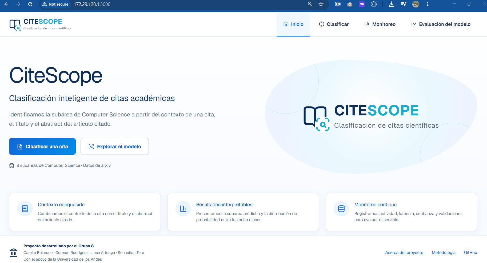
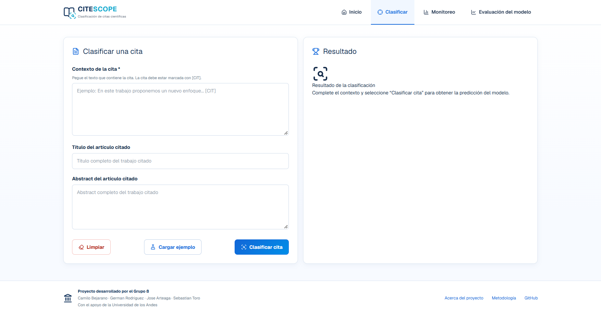
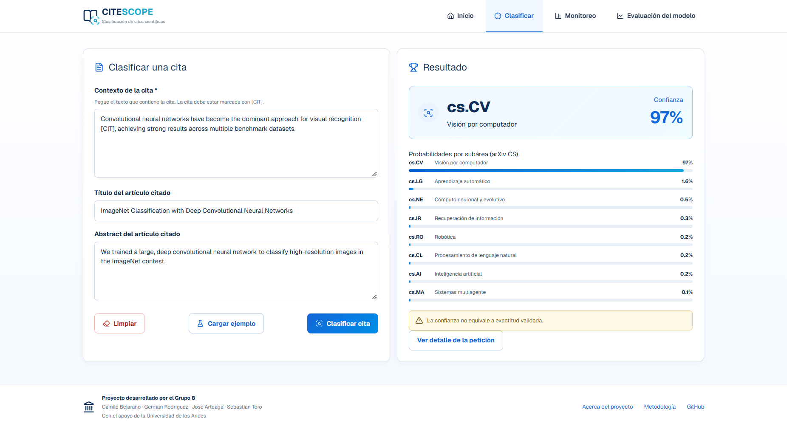
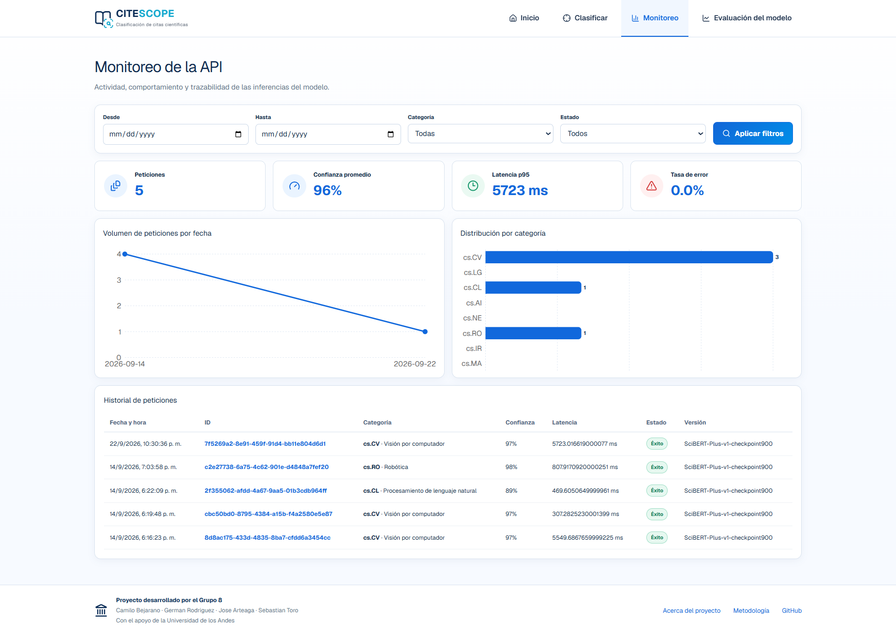
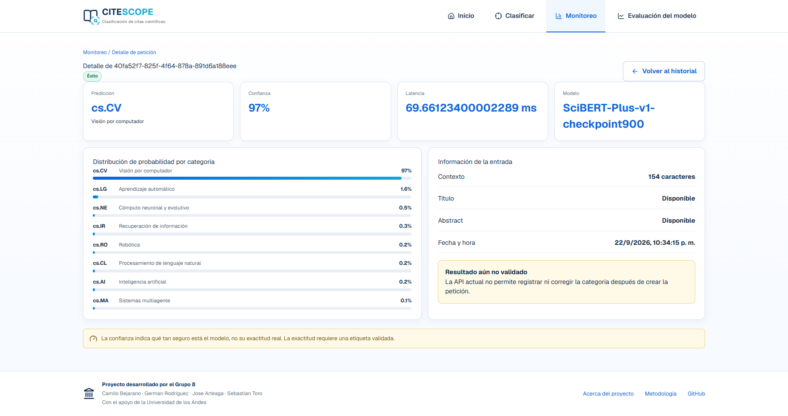
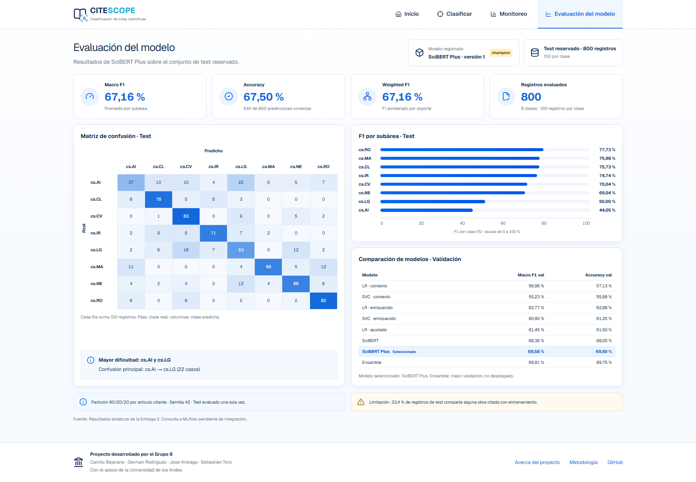

<link rel="stylesheet" href="manualUsario.css">

# Manual de usuario — CiteScope

**Proyecto:** Clasificación de subáreas de Computer Science a partir de citas académicas  
**Entrega:** Final  
**Versión:** 1.0

## Contenido

1. [Presentación](#1-presentacion)
2. [Acceso y navegación](#2-acceso-y-navegacion)
3. [Clasificar una cita](#3-clasificar-una-cita)
4. [Consultar el monitoreo](#4-consultar-el-monitoreo)
5. [Detalle de una petición](#5-revisar-el-detalle-de-una-peticion)
6. [Evaluación del modelo](#6-consultar-la-evaluacion-del-modelo)
7. [Mensajes y solución de problemas](#7-mensajes-y-solucion-de-problemas)
8. [Recorrido de comprobación](#8-recorrido-de-comprobacion)

## 1. Presentación

CiteScope permite clasificar una cita académica en una de ocho subáreas de Computer Science. Para realizar la clasificación, utiliza el contexto donde aparece la cita y, opcionalmente, el título y el resumen del artículo citado.

Este manual explica cómo ingresar información, interpretar una predicción, consultar el historial y revisar la evaluación del modelo. Está dirigido a las personas que utilizan la interfaz web; la instalación y el despliegue se describen en el manual de instalación.

La organización de las pantallas toma como referencia los mockups del proyecto. Los procedimientos corresponden a las funciones implementadas actualmente en el frontend.

## 2. Acceso y navegación

Con la aplicación en funcionamiento, abra en el navegador la dirección indicada por el responsable del despliegue. En la instalación local, la dirección predeterminada es **http://localhost:3000**.

Para clasificar citas y consultar el historial, el servicio de clasificación y el modelo deben estar disponibles. La versión actual no presenta un formulario de inicio de sesión.

La barra superior permite acceder a las siguientes secciones:

| Opción | Uso |
|---|---|
| **Inicio** | Consultar la presentación del proyecto y sus accesos principales. |
| **Clasificar** | Introducir una cita y obtener la categoría predicha. |
| **Monitoreo** | Consultar indicadores, gráficas e historial de peticiones. |
| **Evaluación del modelo** | Revisar los resultados de evaluación del modelo. |

El detalle de una petición se abre desde el resultado de clasificación o desde un ID del historial.

### 2.1. Pantalla de inicio

La pantalla de inicio presenta el propósito de CiteScope y sus características. Seleccione **Clasificar una cita** para comenzar o **Explorar el modelo** para consultar su evaluación. También puede utilizar la barra superior para cambiar de sección.

La opción **Inicio** aparece resaltada en la barra superior para indicar la sección actual. Debajo de los accesos principales se presentan tres características:

- **Contexto enriquecido:** uso del contexto de la cita junto con el título y el abstract del artículo citado.
- **Resultados interpretables:** presentación de la subárea predicha y de las probabilidades entre las ocho clases.
- **Monitoreo continuo:** consulta de la actividad y de los resultados de las solicitudes.

El pie de página identifica al Grupo 8 y presenta los enlaces **Acerca del proyecto**, **Metodología** y **GitHub**. El acceso **Metodología** lleva a la evaluación del modelo.

*Figura 1. Pantalla de inicio de CiteScope con navegación, accesos a clasificación y evaluación, características principales y créditos del proyecto.*

## 3. Clasificar una cita

### 3.1. Preparar la información

Seleccione **Clasificar** en la barra superior. La pantalla contiene el formulario **Clasificar una cita** y el panel **Resultado**.

| Campo | Obligatorio | Qué debe ingresar |
|---|---|---|
| **Contexto de la cita** | Sí | Fragmento del documento que contiene la cita. Marque la cita que desea analizar con `[CIT]`, como indica el formulario. |
| **Título del artículo citado** | No | Título del trabajo al que se refiere la cita. |
| **Abstract del artículo citado** | No | Resumen del trabajo citado. |

El contexto pertenece al documento que realiza la cita. El título y el abstract corresponden al artículo citado. Si no dispone de estos dos últimos datos, puede dejar sus campos vacíos.

*Figura 2. Formulario de clasificación antes de ingresar una cita.*

### 3.2. Enviar la cita

1. Escriba o pegue el **Contexto de la cita**.
2. Complete el título y el abstract si los tiene disponibles.
3. Seleccione **Clasificar cita**.
4. Espere mientras se muestra **Clasificando...** y el mensaje **Procesando la cita...**. Durante el procesamiento, los campos y botones del formulario quedan deshabilitados.
5. Revise el panel **Resultado** cuando termine la solicitud.

El botón **Clasificar cita** permanece deshabilitado cuando el contexto está vacío o contiene únicamente espacios.

Para una primera prueba, seleccione **Cargar ejemplo**. Esta acción completa los tres campos con un caso de ejemplo; después debe seleccionar **Clasificar cita** para enviarlo.

El botón **Limpiar** vacía el formulario y retira el resultado visible. No elimina una petición ya registrada en el historial. Al modificar un campo o cargar el ejemplo, también se retira el resultado anterior para que pueda realizar una nueva clasificación.

### 3.3. Interpretar el resultado

Una clasificación exitosa muestra:

- **Categoría predicha:** código y nombre de la subárea seleccionada por el modelo.
- **Confianza:** puntuación del modelo para la categoría predicha, expresada como porcentaje.
- **Probabilidades por subárea:** distribución de las puntuaciones entre las categorías, presentada mediante barras.
- **Ver detalle de la petición:** acceso a la información de la solicitud registrada.

> **La confianza no equivale a exactitud validada.** Una confianza alta no garantiza que la categoría sea correcta. Para comprobar una predicción es necesario compararla con una categoría de referencia.

*Figura 3. Resultado de una clasificación: cs.IR con 72 % de confianza. Captura de la aplicación desplegada, conservada en la Entrega 3.*

### 3.4. Categorías disponibles

| Código | Subárea |
|---|---|
| `cs.AI` | Inteligencia artificial |
| `cs.CL` | Procesamiento de lenguaje natural |
| `cs.CV` | Visión por computador |
| `cs.IR` | Recuperación de información |
| `cs.LG` | Aprendizaje automático |
| `cs.MA` | Sistemas multiagente |
| `cs.NE` | Cómputo neuronal y evolutivo |
| `cs.RO` | Robótica |

## 4. Consultar el monitoreo

Seleccione **Monitoreo**. Esta pantalla permite revisar las solicitudes registradas, su comportamiento y sus resultados.

### 4.1. Aplicar filtros

1. Seleccione **Desde** y **Hasta** si desea limitar el intervalo de fechas. También puede indicar solo uno de los extremos.
2. Seleccione una **Categoría** o deje **Todas**.
3. Seleccione un **Estado**: **Todos**, **Éxito** o **Error**.
4. Pulse **Aplicar filtros**.

Los filtros afectan el historial, los indicadores y las gráficas. Para recuperar la vista completa, vacíe las fechas, seleccione **Todas** y **Todos**, y vuelva a aplicar los filtros. La fecha inicial no debe ser posterior a la final.

El historial se consulta al entrar en la pantalla. Para ver nuevas solicitudes mientras permanece en ella, recargue la página; **Aplicar filtros** filtra los registros ya cargados.

### 4.2. Interpretar los indicadores y las gráficas

| Elemento | Interpretación |
|---|---|
| **Peticiones** | Número de registros que cumplen los filtros aplicados. |
| **Confianza promedio** | Promedio de confianza de las predicciones exitosas que tienen este dato. |
| **Latencia p95** | Tiempo de inferencia, en milisegundos, bajo el cual se encuentra al menos el 95 % de las latencias registradas en la selección. |
| **Tasa de error** | Porcentaje de registros con estado de error dentro de la selección. |
| **Volumen de peticiones por fecha** | Cantidad de solicitudes agrupadas por fecha. |
| **Distribución por categoría** | Cantidad de registros con cada categoría predicha. |

Las fechas se presentan según la zona horaria del navegador. Un guion **—** indica que no hay un valor disponible para calcular o mostrar la métrica. La latencia registrada corresponde a la inferencia, no al tiempo total de espera en el navegador; los errores de inferencia pueden tener latencia cero.

### 4.3. Abrir una petición del historial

La tabla muestra fecha y hora, ID, categoría, confianza, latencia, estado y versión del modelo. Las solicitudes más recientes aparecen primero.

Seleccione el **ID** de una fila para abrir su detalle. **Éxito** indica que la inferencia terminó correctamente; no significa que su categoría haya sido validada por una persona. Un registro con **Error** puede carecer de categoría y confianza.

*Figura 4. Monitoreo con filtros, indicadores, gráficas e historial de cinco peticiones.*

## 5. Revisar el detalle de una petición

Acceda desde **Ver detalle de la petición** en el resultado o desde el ID de una fila del historial.

La pantalla presenta:

- Identificador y estado de la petición.
- Categoría predicha, confianza, latencia y versión del modelo.
- Distribución de probabilidades por categoría, cuando está disponible.
- Longitud del contexto en **caracteres**.
- Indicación de si se proporcionaron título y abstract.
- Fecha y hora del registro.
- Categoría real, si el registro tiene una; de lo contrario, **Resultado aún no validado**.

La información de entrada resume la disponibilidad de los campos; esta pantalla no muestra los textos completos enviados. En la versión actual no es posible confirmar ni corregir una categoría desde el frontend.

Seleccione **Volver al historial** para regresar al monitoreo.

Las capturas de clasificación, monitoreo y detalle ilustran solicitudes distintas. Para seguir una misma solicitud en su propia sesión, compruebe siempre su ID.

*Figura 5. Detalle de una petición de ejemplo: cs.CV con 97 % de confianza y 154 caracteres de contexto.*

## 6. Consultar la evaluación del modelo

Seleccione **Evaluación del modelo** para revisar los resultados publicados de SciBERT Plus. Esta pantalla muestra una evaluación previamente realizada; sus métricas no se recalculan con las citas enviadas desde el formulario.

### 6.1. Métricas generales

| Indicador | Significado |
|---|---|
| **Macro F1** | Promedio de F1 entre las subáreas, dando el mismo peso a cada una. F1 combina precisión y capacidad de recuperar los casos de una clase. |
| **Accuracy** | Porcentaje de predicciones correctas en el conjunto evaluado. |
| **Weighted F1** | Promedio de F1 ponderado por la cantidad de ejemplos de cada clase. |
| **Registros evaluados** | Número de ejemplos utilizados en la evaluación. |

La evaluación incluida actualmente utiliza 800 registros de test, con 100 por clase. Presenta Macro F1 de **67,16 %**, Accuracy de **67,50 %** y Weighted F1 de **67,16 %**.

### 6.2. Matriz de confusión y resultados por subárea

En **Matriz de confusión · Test**, las filas corresponden a la clase real y las columnas a la clase predicha. La diagonal contiene los aciertos; las demás celdas muestran confusiones entre clases. Los valores de las celdas son cantidades de registros.

En **F1 por subárea · Test**, las barras muestran el F1 de cada clase en porcentaje, ordenado de mayor a menor. Al mantener el cursor sobre una barra puede consultar precisión, recall y soporte. El soporte es la cantidad de ejemplos de esa clase.

En pantallas estrechas puede desplazarse horizontalmente dentro de la matriz para consultar sus columnas.

### 6.3. Comparación de modelos

La tabla **Comparación de modelos · Validación** muestra resultados obtenidos durante la selección del modelo. Estos resultados corresponden al conjunto de validación; las tarjetas principales y la matriz corresponden al conjunto de test.

SciBERT Plus aparece como modelo seleccionado. El ensamble figura como el de mejor validación, pero no es el modelo desplegado. Consulte también las notas al final de la pantalla sobre la partición de datos y las limitaciones de la evaluación.

*Figura 6. Evaluación de SciBERT Plus: métricas de test, matriz de confusión y comparación de validación.*

## 7. Mensajes y solución de problemas

| Situación | Acción recomendada |
|---|---|
| **Clasificar cita** está deshabilitado. | Ingrese un contexto que no esté vacío o espere a que termine la solicitud en curso. |
| Aparece un error de conexión con CiteScope API. | Solicite al responsable del servicio que compruebe su disponibilidad y la carga del modelo. Después vuelva a enviar la cita o utilice **Reintentar**, cuando esté disponible. |
| La clasificación informa un error de inferencia. | Revise la entrada y vuelva a intentarlo. Si persiste, comunique el mensaje al responsable del servicio. |
| **No hay peticiones para los filtros seleccionados.** | Amplíe el intervalo, quite los filtros o realice una primera clasificación si el historial está vacío. |
| No aparece una petición reciente. | Recargue el monitoreo y compruebe los filtros aplicados. |
| **Petición no encontrada.** | Vuelva al historial y abra uno de los IDs disponibles. |
| **No hay probabilidades disponibles para esta petición.** | Revise el estado del registro; una inferencia fallida puede no tener probabilidades. |
| La predicción no coincide con la categoría que esperaba. | Revise que el contexto, el título y el abstract correspondan a la misma cita. El modelo puede equivocarse y la interfaz actual no permite corregir el registro. |

## 8. Recorrido de comprobación

Para familiarizarse con la aplicación, realice este recorrido:

1. Abra **Inicio** y seleccione **Clasificar una cita**.
2. Pulse **Cargar ejemplo** y luego **Clasificar cita**.
3. Revise la categoría, la confianza y las probabilidades obtenidas.
4. Abra **Ver detalle de la petición** y compruebe su identificador.
5. Seleccione **Volver al historial** y localice la solicitud.
6. Aplique un filtro por la categoría obtenida y compruebe que la petición permanece visible.
7. Abra **Evaluación del modelo** y consulte las métricas del conjunto de test.

Los valores de confianza y latencia de las capturas corresponden a la ejecución utilizada para ilustrar el manual; no deben interpretarse como valores fijos para nuevas solicitudes.
