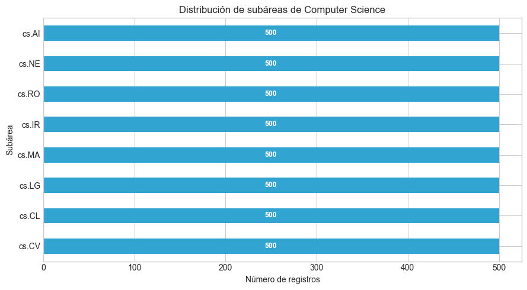
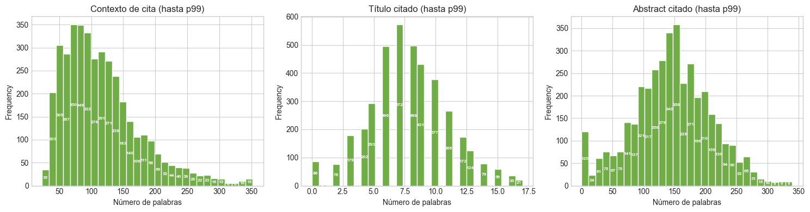
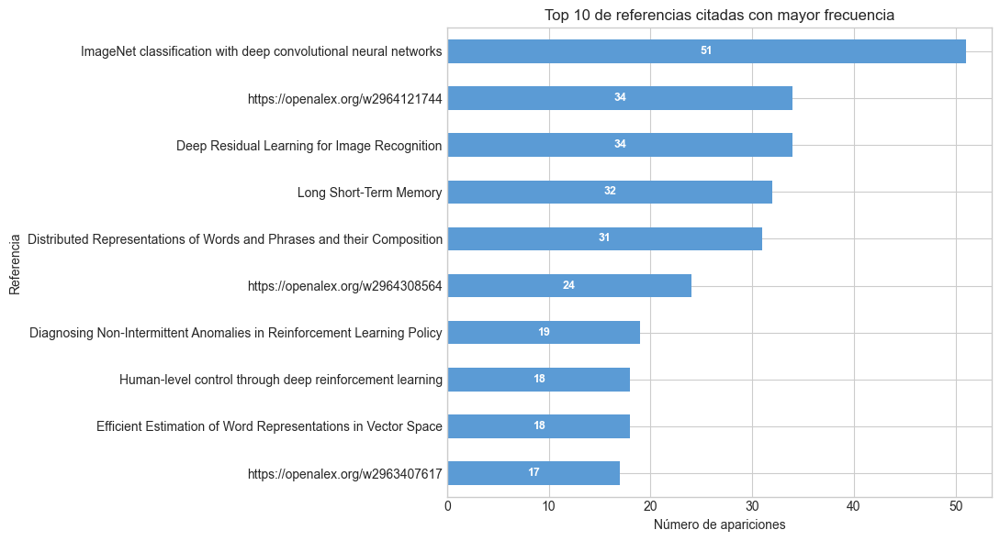
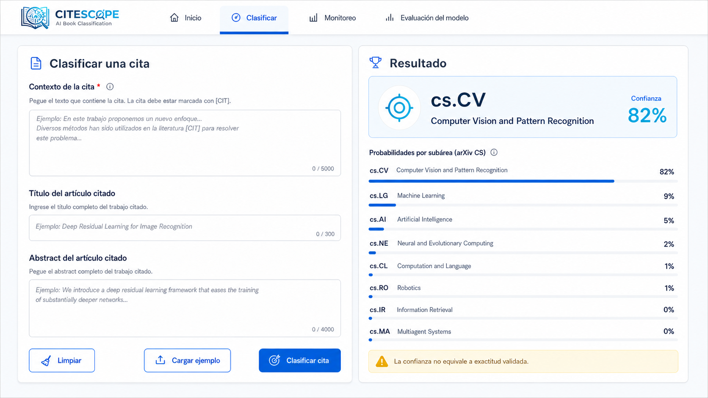
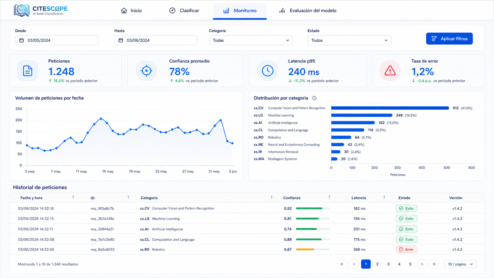
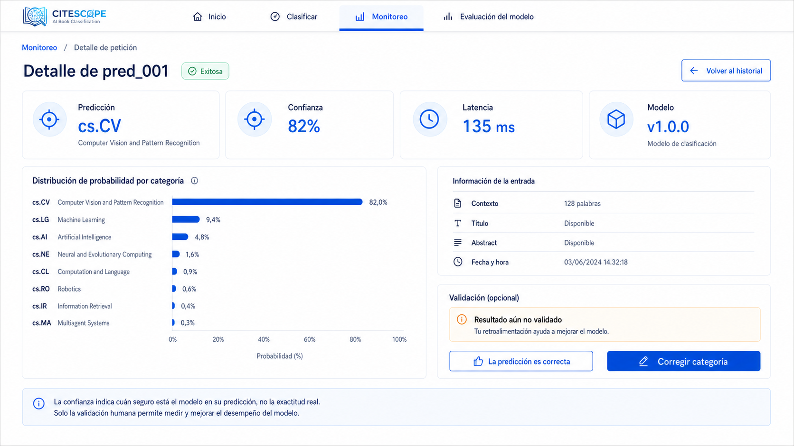
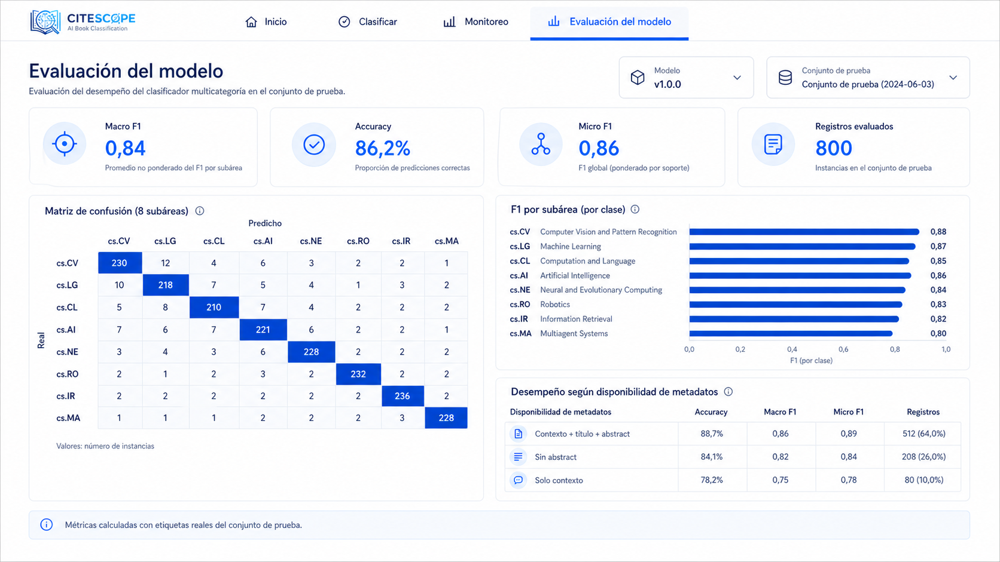

# CiteScope — Reporte Entrega 1 (MicroProyecto)

**Equipo (Grupo 8):**
- Camilo Bejarano — c.bejaranoc@uniandes.edu.co
- German Rodriguez — gm.rodriguez@uniandes.edu.co
- Jose Arteaga — j.arteagac@uniandes.edu.co
- Sebastian Toro — s.torod@uniandes.edu.co

**Curso:** Proyecto - Desarrollo de Soluciones / MAIA
**Fecha:** Agosto 2026

---

## 1. Problema que abordarán y su contexto

Clasificación de la **subárea de Computer Science** de un artículo científico a
partir del **contexto de la cita** y de los **metadatos (título y abstract) del
artículo citado**.

- **Contexto general:** el volumen de literatura científica en arXiv crece de forma
  acelerada, lo que dificulta organizar, indexar y descubrir trabajos por su
  subárea temática. Cuando un artículo cita a otro, el párrafo donde ocurre la cita
  y los metadatos del trabajo citado ofrecen señales sobre el tema que se está
  abordando. Este proyecto aprovecha esas señales para inferir automáticamente la
  subárea de Computer Science del artículo citante.
- **Motivación / valor:** clasificar la subárea permite organizar y navegar grandes
  colecciones de literatura, apoyar la indexación temática y la recomendación de
  artículos, y agilizar tareas de revisión bibliográfica al agrupar trabajos por su
  área de conocimiento sin depender de etiquetas manuales.
- **Dominio:** artículos científicos en inglés de **Computer Science** (arXiv).

---

## 2. Pregunta de negocio y alcance del proyecto

**Pregunta de negocio:**
> ¿Es posible predecir la subárea de Computer Science (los códigos `cs.*` de
> arXiv, p. ej. `cs.LG` = *Machine Learning*) de un artículo a partir del
> contexto de la cita y de los metadatos (título y abstract) del artículo citado?

**Alcance (prototipo funcional):**

1. **Datos:** dataset supervisado de 4.000 contextos de cita etiquetados por subárea
   (8 subáreas de Computer Science de arXiv, ver Sección 3), enriquecidos
   con título y abstract del artículo citado.
2. **Modelo:** clasificador multiclase supervisado (Context-enriched):
   `citation_context + cited_title + cited_abstract → citing_primary_category`
   (subárea de Computer Science del citante).
3. **Prototipo tecnológico:**
   - **API** para servir inferencias.
   - **Tablero (dashboard)** que consuma la API y visualice datos relevantes.
   - **Despliegue con Docker** (contenedores).
4. **Limitaciones:**
   - **Sesgo de selección por abstract:** la construcción priorizó registros con
     abstract disponible (cobertura ~98%), por lo que el dataset no refleja la
     proporción real de citas sin metadatos y el modelo podría degradarse ante
     entradas sin título o abstract.
   - **Sesgo de sección:** aunque se aplicó muestreo distribuido, los contextos de
     cita se concentran en secciones como *Introduction* y *Related Work*, lo que
     puede sesgar el lenguaje aprendido hacia el estilo de esas secciones.
   - **Dominio acotado a 8 subáreas:** solo se consideran 8 categorías `cs.*`; el
     modelo no reconoce otras subáreas de Computer Science ni disciplinas distintas.
   - **Etiqueta única (single-label):** se asume una sola subárea por artículo
     (`citing_primary_category`), pese a que muchos trabajos son multidisciplinarios
     y podrían pertenecer a varias categorías.
   - **Posible fuga de información por obras citadas repetidas:** una misma obra
     puede aparecer en varias particiones, por lo que la estrategia de partición
     debe controlarlo para no sobreestimar el desempeño.
5. **Resultados esperados:**
   - **Baseline (solo contexto):** clasificador sobre `citation_context` únicamente,
     como referencia mínima frente al azar (12,5% en 8 clases balanceadas).
   - **Modelo enriquecido (contexto + título + abstract):** se espera que la adición
     de los metadatos del artículo citado supere de forma consistente al baseline.
   - **Métrica principal:** *Macro F1* (trata por igual a las 8 clases balanceadas),
     acompañada de *accuracy* y F1 por categoría; meta orientativa de Macro F1 ≥ 0,70
     para el modelo enriquecido, a confirmar con la evaluación.
   - **Entregable:** matriz de confusión y desempeño por subárea para identificar
     categorías más difíciles y confusiones entre áreas cercanas (p. ej. `cs.AI`,
     `cs.LG` y `cs.NE`).

**Fuera de alcance (por ahora):**
- Clasificación de la *función* de la cita.
- Recuperación semántica del texto completo del artículo citado.
- Predicción multi-etiqueta (un artículo se asigna a una sola subárea).
- Subáreas de arXiv fuera de las 8 seleccionadas y disciplinas distintas a Computer Science.
- Artículos en idiomas distintos al inglés.

---

## 3. Descripción de los conjuntos de datos

### 3.1 Exploración de fuentes candidatas

Antes de decidir se evaluaron cuatro fuentes bajo la restricción de dominio
(**Computer Science / arXiv**). La tabla resume el hallazgo crítico y la decisión:

| Dataset | Dominio | Hallazgo crítico | Decisión |
|---|---|---|---|
| **SciCite** | Mayormente biomédico | Solo 3 clases de *función* de cita; ~1.7% de citas enlazables a arXiv | Descartado |
| **ACL-ARC** | CS / NLP | Muy pequeño (~1.9k); 65% de citas "External"; abstract del citado ~21% | Referencia secundaria |
| **MultiCite** | CS / NLP | IDs de paper anonimizados (hash de 30 chars) → el citado **no es resoluble** | Descartado |
| **unarXive** | **arXiv (CS-heavy)** | Ninguno crítico; texto completo + citas resueltas a IDs reales | **Seleccionado** |

**Por qué unarXive:** es nativo de arXiv (filtrable por `discipline == "Computer
Science"`), trae el texto completo estructurado y resuelve cada cita a
identificadores reales del artículo citado (OpenAlex / DOI), lo que habilita el
enriquecimiento con título y abstract. Además, el mismo corpus se reutiliza en el
Proyecto de Grado (recuperación de texto completo por el arXiv ID del citado).

> El detalle completo de la exploración y los motivos de descarte está en
> `Dataset/Resumen_Seleccion_Dataset.md`.

### 3.2 Fuentes de datos

**Fuente primaria — unarXive (open subset):** corpus de arXiv preprocesado para NLP
(texto completo estructurado + red de citas). Zenodo, registro 7752615,
`unarXive_230324_open_subset.tar.xz` (4.8 GB), licencia CC BY-SA 4.0.

**Fuente de enriquecimiento — OpenAlex:** título y abstract del artículo citado,
resueltos por su `open_alex_id` (el abstract se reconstruye desde el
`abstract_inverted_index`). Como un párrafo (`citation_context`) puede contener
varias citas, a nivel de registro se toma la **primera cita del párrafo que tenga
abstract** disponible (y si ninguna lo tiene, la primera con título); esto maximiza
la cobertura de abstract del dataset.

### 3.3 Construcción del dataset (pipeline en 3 etapas)

El dataset se construyó con un pipeline reproducible (scripts en `scripts/`):

```text
unarXive (corpus local, CS)
        │  Etapa 1 — harvest_candidates.py
        ▼
Candidatos con excedente por clase   (7.103 candidatos)
        │  Etapa 2 — enrich_select.py  (OpenAlex: title + abstract)
        ▼
Enriquecimiento del artículo citado
        │  Etapa 3 — enrich_select.py  (selección balanceada)
        ▼
Dataset final 8 × 500 = 4.000 registros
```

- **Etapa 1 — Cosecha:** recorrido del corpus filtrando `Computer Science`, con
  **muestreo distribuido por secciones** (reduce el sesgo de "Introduction"),
  **anti-memorización** (máx. 4 contextos por artículo), deduplicación y longitud
  mínima de 200 caracteres. El marcador `{{cite:...}}` se normaliza a `[CIT]`.
  Resultado: ~165.000 artículos escaneados, **1.807** de CS usados, **7.103**
  candidatos cosechados (con excedente).
- **Etapa 2 — Enriquecimiento:** resolución de título/abstract del citado vía
  OpenAlex, con preferencia de selección a registros que tienen abstract.
- **Etapa 3 — Selección balanceada:** 500 registros por clase (8 × 500 = 4.000),
  con tolerancia de balance ±10%; el resultado cumplió el balance exacto.

**Dataset resultante:** `unarxive_microproyecto.jsonl` — 4.000 registros,
8 subáreas × 500 (balanceado).

| Campo | Rol | Descripción |
|---|---|---|
| `citation_context` | Input (X) | Párrafo del citante con la cita (marcador → `[CIT]`) |
| `cited_title` | Input (X) | Título del artículo citado |
| `cited_abstract` | Input (X) | Abstract del artículo citado |
| `citing_primary_category` | Target (y) | Subárea de Computer Science (`cs.*`) del citante |
| `section` / `sec_type` | aux | Sección del citante donde ocurre la cita |
| `cited_refs[]` | aux | Todas las citas del párrafo con sus IDs |

**Subáreas (target):** las 8 subáreas de Computer Science de arXiv usadas como
etiquetas de clasificación.

| Código arXiv | Nombre de la subárea |
|---|---|
| `cs.LG` | Machine Learning (aprendizaje automático) |
| `cs.CV` | Computer Vision and Pattern Recognition (visión por computador) |
| `cs.CL` | Computation and Language (procesamiento de lenguaje natural) |
| `cs.AI` | Artificial Intelligence (inteligencia artificial) |
| `cs.NE` | Neural and Evolutionary Computing (cómputo neuronal y evolutivo) |
| `cs.RO` | Robotics (robótica) |
| `cs.IR` | Information Retrieval (recuperación de información) |
| `cs.MA` | Multiagent Systems (sistemas multiagente) |

**Disponibilidad:** el dataset está versionado con **DVC**. El repositorio Git
contiene el puntero `Dataset/unarxive_microproyecto.jsonl.dvc`; el archivo de datos
(`unarxive_microproyecto.jsonl`, ~20,3 MB, MD5 `ab4dae83062d1de3238c419cbd3d3a4c`)
se almacena en un remoto **S3** (`s3://gaspar3107-tech-taller3-dvc-20260816/maia4401-microproyecto`,
región `us-east-1`). Para obtenerlo: clonar el repositorio y ejecutar `dvc pull`
(requiere credenciales de acceso al bucket).

---

## 4. Exploración de los datos (EDA)

Resumen de los principales hallazgos verificados durante la construcción:

- **Balance de clases:** 500 registros por subárea (8 × 500 = 4.000).
- **Cobertura de `cited_title`:** 97,9 % · **`cited_abstract`:** 98,1 %.
- **Distribución por sección:** Introducción ~25% (resto: Related Work, Discussion,
  Experiments, Results, …).

### 4.1 Visualizaciones principales

#### Distribución de las clases

Las ocho subáreas se encuentran balanceadas, con 500 observaciones por clase.



#### Longitud del contexto de cita

La distribución de la longitud permite identificar el tamaño típico de los
contextos y la existencia de registros considerablemente más extensos.


#### Distribución de las secciones

Esta visualización muestra en qué tipos de sección aparecen los contextos de cita
seleccionados para el conjunto de datos.



#### Número de citas por párrafo

La gráfica resume cuántos marcadores de cita contiene cada contexto y permite
observar la concentración de párrafos con una o pocas referencias.



#### Referencias citadas y subáreas

El mapa de calor relaciona las referencias citadas con las categorías objetivo.
Permite identificar obras asociadas principalmente con una subárea y referencias
transversales a varias comunidades. También evidencia el posible riesgo de fuga
de información si una misma obra aparece en las particiones de entrenamiento y
prueba.


> **Nota:** esta sección presenta los principales resultados del análisis
> exploratorio. Para consultar las tablas, validaciones, cálculos y visualizaciones
> con mayor detalle, véase el notebook
> [`AnalisisEDA.ipynb`](../eda/AnalisisEDA.ipynb).

---

## 5. Maqueta (mockup) del prototipo

Elementos previstos del prototipo:
- **Entrada:** campo para pegar el contexto de la cita (+ opcional título y abstract del citado).
- **Salida:** subárea `cs.*` predicha + probabilidades por clase.
- **Visualizaciones:** distribución de predicciones, confianza del modelo, métricas
  de evaluación, actividad de la API y detalle de las inferencias realizadas.
- **Relación con la pregunta de negocio:** el tablero permite probar si el contexto
  de la cita y los metadatos del artículo citado contienen información suficiente
  para asignar una de las ocho subáreas. Además de presentar la categoría predicha,
  permite inspeccionar la incertidumbre del modelo y monitorear su comportamiento
  después del despliegue.

### 5.1 Vistas propuestas

El prototipo tendrá tres vistas principales:

1. **Clasificar cita:** formulario con `citation_context`, `cited_title` y
   `cited_abstract`. La respuesta mostrará la subárea predicha, su nombre completo,
   la confianza y las probabilidades para las ocho categorías.
2. **Monitoreo:** resumen de las predicciones atendidas por la API y su evolución
   en el tiempo.
3. **Evaluación del modelo:** métricas calculadas sobre un conjunto etiquetado,
   incluyendo Macro F1, accuracy, precision, recall, F1 por categoría y matriz de
   confusión.

La confianza de una inferencia no se presentará como una medida de exactitud. Las
métricas de desempeño requieren una etiqueta real y se calcularán inicialmente
sobre el conjunto de prueba. Cuando una predicción en producción reciba una
etiqueta validada, podrá incorporarse a las métricas de producción.

### 5.2 Registro de inferencias de la API

Cada solicitud atendida por la API generará un registro de monitoreo. Como mínimo,
el registro tendrá:

| Campo y descripción | Campo y descripción | Campo y descripción |
|---|---|---|
| **`prediction_id`**<br>ID único | **`timestamp`**<br>Fecha y hora | **`model_version`**<br>Versión del modelo |
| **`predicted_category`**<br>Subárea predicha | **`confidence`**<br>Probabilidad principal | **`class_probabilities`**<br>Probabilidades por categoría |
| **`latency_ms`**<br>Tiempo de respuesta | **`has_cited_title`**<br>Disponibilidad de título | **`has_cited_abstract`**<br>Disponibilidad de abstract |
| **`citation_context_length`**<br>Longitud del contexto | **`status`**<br>Éxito o error | **`actual_category`**<br>Etiqueta real, si existe |

El almacenamiento del texto completo será configurable. Para reducir riesgos de
privacidad, el monitoreo puede conservar únicamente características derivadas,
como longitudes, presencia de metadatos y un hash de la entrada.

### 5.3 Tablero de monitoreo

La parte superior mostrará tarjetas con indicadores del periodo seleccionado:

- total de peticiones;
- predicciones exitosas y tasa de error;
- latencia promedio y percentil 95;
- confianza promedio;
- porcentaje de predicciones de baja confianza;
- categoría predicha con mayor frecuencia;
- porcentaje de entradas sin título o sin abstract.

El tablero incluirá una gráfica temporal del volumen de solicitudes, una gráfica
de barras con la distribución de categorías predichas y una distribución de la
confianza. Estas métricas permiten monitorear el uso y comportamiento del servicio,
pero no reemplazan las métricas de desempeño obtenidas con etiquetas reales.

### 5.4 Historial y detalle de peticiones

El tablero tendrá un listado paginado de peticiones con las columnas:

| Fecha y hora | ID | Categoría predicha | Confianza | Latencia | Estado | Versión |
|---|---|---|---:|---:|---|---|
| 2026-08-20 14:30 | `pred_001` | `cs.CV` | 82% | 135 ms | Exitosa | v1.0.0 |

El listado permitirá filtrar por:

- rango de fechas;
- categoría predicha;
- estado de la petición;
- versión del modelo;
- nivel de confianza.

Al hacer clic sobre una petición se abrirá un panel de detalle con:

- fecha, identificador, estado y versión del modelo;
- disponibilidad y longitud de los campos de entrada;
- categoría predicha y nombre completo de la subárea;
- gráfica de probabilidades para las ocho categorías;
- diferencia entre las dos categorías con mayor probabilidad;
- latencia de la petición;
- etiqueta real y resultado correcto/incorrecto, si ya existe validación;
- opción de registrar retroalimentación o categoría corregida.

Cuando exista una etiqueta real, el detalle permitirá establecer si la predicción
fue correcta y cómo contribuye a las métricas del modelo. Cuando no exista, la
interfaz indicará **“Resultado aún no validado”** para evitar interpretar la
confianza como desempeño comprobado.

### 5.5 Boceto de navegación

Los mockups de las pantallas propuestas se presentan en la **[Sección 8](#8-mockups-del-prototipo)**. Estos muestran el flujo desde la página de inicio hasta la clasificación, el monitoreo de peticiones, el detalle de una inferencia y la evaluación del modelo.

---

## 6. Repositorios (código y datos)

**Git (código):** https://github.com/germarodr/MAIA4401_MicroProyecto.git

**DVC (datos):** [PENDIENTE/Jose: enlace del remoto + capturas de `dvc add`/`dvc push`].

Pendientes de soporte (capturas):
- [PENDIENTE/Jose: inicialización de Git y DVC].
- [PENDIENTE/Jose: dataset versionado con DVC (`.dvc`)].
- [PENDIENTE/Jose: remoto de almacenamiento (S3/otro)].
- [PENDIENTE/Jose: estructura del repositorio].

---

## 7. Reporte de trabajo en equipo (máx. 1 página)

| Integrante | Tareas |
|---|---|
| Camilo Bejarano | [PENDIENTE/Camilo: tareas + evidencia de commits] |
| German Rodriguez | Creación del repositorio Git; selección del dataset (unarXive) y pipeline de datos (harvest/enrich); reporte (Secciones 1–3); revisión cruzada del EDA. Commits: `94d5419`, `271d266`, `fecab37`, `5700cfa`. |
| Jose Arteaga | [PENDIENTE/Jose: tareas + evidencia de commits] |
| Sebastian Toro | [PENDIENTE/Sebas: tareas + evidencia de commits] |

---

## 8. Referencias y anexos
***Mockups del prototipo***

Las siguientes imágenes presentan la propuesta visual de CiteScope. Los datos,
predicciones y métricas mostrados son ilustrativos; en la implementación final
deberán obtenerse desde la API, el registro de inferencias y los resultados reales
de evaluación del modelo.

### 8.1 Página de inicio

Presenta el propósito del proyecto, los accesos a sus funcionalidades principales,
los integrantes del equipo y el apoyo de la Universidad de los Andes.


### 8.2 Clasificación de una cita

Permite ingresar el contexto de la cita, el título y el abstract del artículo
citado. La salida muestra la subárea predicha, la confianza y las probabilidades
de las ocho categorías.



### 8.3 Monitoreo de la API

Resume el volumen de peticiones, la confianza promedio, la latencia y los errores.
También incluye filtros por fecha y categoría, junto con el historial de
inferencias.



### 8.4 Detalle de una petición

Muestra la información de una inferencia seleccionada, sus probabilidades,
metadatos de entrada, versión del modelo y estado de validación.



### 8.5 Evaluación del modelo

Presenta las métricas calculadas con datos etiquetados, incluyendo Macro F1,
accuracy, matriz de confusión y desempeño por subárea.



### 8.6 Referencias y anexos

- Saier, T., Krause, J., Färber, M. (2023). *unarXive 2022: All arXiv Publications
  Pre-Processed for NLP, Including Structured Full-Text and Citation Network.* JCDL '23.
- OpenAlex. https://openalex.org/
- [PENDIENTE: referencias adicionales del dominio de análisis de citas].
