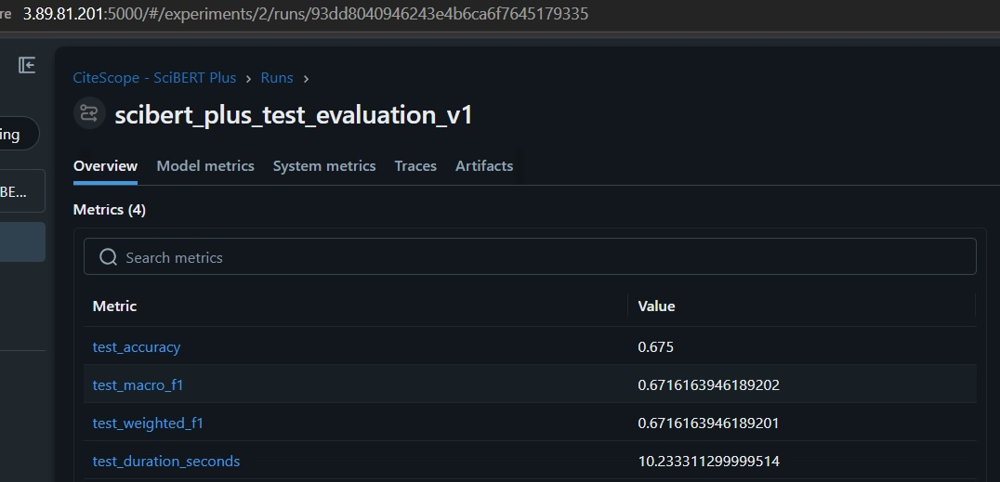
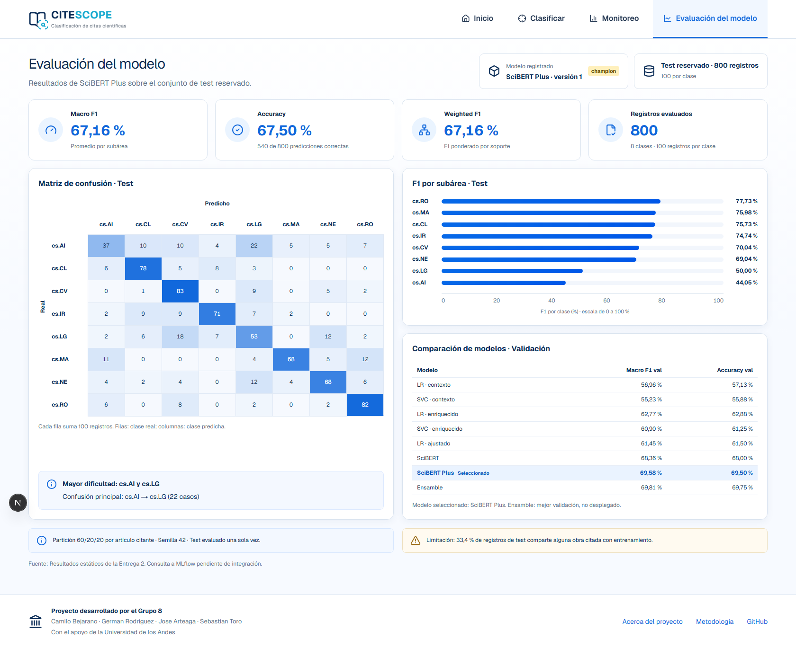

<h1>CiteScope — Microproyecto Entrega 2</h1>

<strong>Proyecto — Desarrollo de Soluciones / MAIA — Grupo 8</strong> 

<strong>Camilo Bejarano&nbsp;&nbsp;·&nbsp;&nbsp;German Rodriguez&nbsp;&nbsp;·&nbsp;&nbsp;Jose Arteaga&nbsp;&nbsp;·&nbsp;&nbsp;Sebastian Toro</strong>

Universidad de los Andes - Septiembre de 2026 

# 1. Resumen del problema

## 1.1 Contexto y pregunta de negocio

El crecimiento acelerado de la literatura científica en arXiv dificulta la organización, indexación y recuperación de artículos por subárea temática. En Computer Science, el contexto en el que un artículo cita a otro y los metadatos del trabajo citado aportan señales semánticas que pueden utilizarse para clasificar automáticamente el área del artículo citante.

CiteScope busca responder la siguiente pregunta de negocio:

> ¿Es posible predecir la subárea de Computer Science de un artículo científico a partir del contexto de una cita y del título y el resumen del artículo citado?

## 1.2 Objetivo y alcance

El objetivo es desarrollar un prototipo funcional que clasifique un contexto de cita en una de ocho subáreas `cs.*` de arXiv. La entrada combina el contexto de la cita, el título y el resumen del artículo citado; la salida corresponde a la categoría predicha, su nivel de confianza y la distribución de probabilidades entre las ocho clases.

La Entrega 2 comprende el desarrollo y comparación de modelos supervisados, el seguimiento de experimentos con MLflow, la evaluación del modelo seleccionado y el avance de un tablero que permita consumir y visualizar las predicciones.

## 1.3 Datos utilizados

Se utiliza un conjunto construido a partir de **unarXive** y enriquecido con metadatos de **OpenAlex**. El dataset contiene 4.000 registros balanceados, con 500 ejemplos para cada una de las siguientes subáreas: `cs.AI`, `cs.CL`, `cs.CV`, `cs.IR`, `cs.LG`, `cs.MA`, `cs.NE` y `cs.RO`.

| Campo | Función |
|---|---|
| `citation_context` | Párrafo del artículo citante donde aparece la cita. |
| `cited_title` | Título del artículo citado. |
| `cited_abstract` | Resumen del artículo citado. |
| `citing_primary_category` | Subárea `cs.*` utilizada como variable objetivo. |

El 100% de los registros contiene contexto de cita; el 97,9% tiene un título citado no vacío y el 98,1% contiene el resumen del artículo citado. El archivo local tiene el mismo hash MD5 registrado en DVC (`ab4dae83062d1de3238c419cbd3d3a4c`), lo que confirma la correspondencia con la versión de datos utilizada en los experimentos.

## 1.4 Cambios respecto a la Entrega 1

La Entrega 1 delimitó el problema, seleccionó los datos, construyó el dataset y definió la maqueta. En esta entrega se implementó una partición reproducible sin cruce de artículos citantes, se entrenaron y compararon modelos clásicos y SciBERT, se registraron los experimentos en MLflow y se evaluó una sola vez el conjunto de test; SciBERT Plus se versionó como modelo `champion` y se actualizaron los mockups con resultados reales.

También se construyó un frontend navegable que materializa la propuesta visual de la Entrega 1: la vista de evaluación consume las predicciones reales del modelo `champion` sobre el test, mientras que clasificación y monitoreo operan sobre un contrato que reproduce la respuesta de la API de inferencia (Figura 6). La conexión en vivo con dicha API es el paso de despliegue restante.

# 2. Modelos desarrollados y evaluación

## 2.1 Preparación de datos y protocolo de evaluación

Los 4.000 registros se dividieron de forma reproducible en entrenamiento (2.400; 60%), validación (800; 20%) y test (800; 20%), utilizando la semilla 42. La asignación se realizó por `citing_arxiv_id`, de modo que todos los contextos provenientes de un mismo artículo citante permanecieran en una sola partición. No se encontraron artículos citantes compartidos entre los tres subconjuntos y cada partición conservó exactamente la misma proporción de las ocho clases.

El conjunto de validación se utilizó para comparar modelos, seleccionar hiperparámetros y escoger el checkpoint. El test permaneció reservado hasta finalizar esas decisiones y se evaluó una sola vez con el modelo registrado. Como limitación, el 33,4% de los registros de test contiene al menos una obra citada que también aparece en train; aunque el artículo citante y la variable objetivo permanecen aislados, esta coincidencia constituye una posible dependencia semántica residual que debe considerarse al interpretar la generalización.

Para los modelos clásicos se construyeron dos entradas: `text_context`, que utiliza únicamente el contexto de la cita, y `text_enriched`, que concatena contexto, título y resumen. La representación empleó TF-IDF con unigramas y bigramas, `min_df=3` y escalamiento sublineal. Para SciBERT Plus se conservaron segmentos separados dentro de una longitud máxima de 512 tokens: 192 para el contexto, 48 para el título y 268 para el resumen, además de los tokens especiales.

## 2.2 Modelos comparados

<table style="width:100%; table-layout:fixed">
  <colgroup>
    <col style="width:26%">
    <col style="width:42%">
    <col style="width:32%">
  </colgroup>
  <thead>
    <tr><th>Modelo</th><th>Entrada y configuración principal</th><th>Propósito</th></tr>
  </thead>
  <tbody>
    <tr><td>Logistic Regression</td><td>TF-IDF; contexto solamente</td><td>Línea base interpretable y de bajo costo.</td></tr>
    <tr><td>Linear SVC</td><td>TF-IDF; contexto solamente</td><td>Segunda referencia clásica.</td></tr>
    <tr><td>Logistic Regression enriquecido</td><td>TF-IDF; contexto, título y resumen</td><td>Medir el aporte de los metadatos citados.</td></tr>
    <tr><td>Linear SVC enriquecido</td><td>TF-IDF; contexto, título y resumen</td><td>Contrastar el efecto del enriquecimiento.</td></tr>
    <tr><td>Logistic Regression ajustado</td><td>Búsqueda de hiperparámetros sobre texto enriquecido</td><td>Verificar si el ajuste supera la configuración predeterminada.</td></tr>
    <tr><td>SciBERT</td><td><code>allenai/scibert_scivocab_uncased</code>, máximo 512 tokens</td><td>Aprovechar representaciones preentrenadas sobre texto científico.</td></tr>
    <tr><td>SciBERT Plus</td><td>Presupuesto de tokens por campo, búsqueda de <em>learning rate</em> y tres semillas</td><td>Mejorar el uso de la entrada y medir estabilidad.</td></tr>
    <tr><td>Ensamble</td><td>90% SciBERT Plus y 10% Logistic Regression</td><td>Combinar señales neuronales y léxicas.</td></tr>
  </tbody>
</table>

## 2.3 Resultados de validación y test

| Modelo | Macro F1 val | Accuracy val |
|---|---:|---:|
| Logistic Regression — contexto | 0,5696 | 0,5713 |
| Linear SVC — contexto | 0,5523 | 0,5588 |
| Logistic Regression — enriquecido | 0,6277 | 0,6288 |
| Linear SVC — enriquecido | 0,6090 | 0,6125 |
| Logistic Regression — ajustado | 0,6145 | 0,6150 |
| SciBERT | 0,6836 | 0,6800 |
| SciBERT Plus | 0,6958 | 0,6950 |
| Ensamble SciBERT Plus + Logistic Regression | **0,6981** | **0,6975** |

El enriquecimiento aumentó el Macro F1 de Logistic Regression en 0,0581 frente al contexto solo. SciBERT mejoró otros 0,0559 respecto al mejor modelo clásico enriquecido. En SciBERT Plus, un *learning rate* de `1e-05` produjo el mejor resultado; al repetir esta configuración con semillas 42, 17 y 73 se obtuvo un Macro F1 medio de 0,6870 y una desviación estándar de 0,0077.

El ensamble obtuvo el mayor resultado de validación, pero su ganancia sobre SciBERT Plus fue de solo 0,0022. El artefacto finalmente registrado y evaluado en test fue el checkpoint individual de SciBERT Plus con semilla 42, no el ensamble. Sobre las 800 observaciones reservadas obtuvo **0,6750 de accuracy**, **0,6716 de Macro F1** y **0,6716 de Weighted F1**. La disminución frente a validación fue de aproximadamente 0,0242 puntos de Macro F1.

## 2.4 Evaluación por clase y análisis de errores

| Clase | Precision | Recall | F1 | Soporte |
|---|---:|---:|---:|---:|
| `cs.AI` | 0,5441 | 0,3700 | 0,4405 | 100 |
| `cs.CL` | 0,7358 | 0,7800 | 0,7573 | 100 |
| `cs.CV` | 0,6058 | 0,8300 | 0,7004 | 100 |
| `cs.IR` | 0,7889 | 0,7100 | 0,7474 | 100 |
| `cs.LG` | 0,4732 | 0,5300 | 0,5000 | 100 |
| `cs.MA` | 0,8608 | 0,6800 | 0,7598 | 100 |
| `cs.NE` | 0,7010 | 0,6800 | 0,6904 | 100 |
| `cs.RO` | 0,7387 | 0,8200 | **0,7773** | 100 |

El desempeño más alto corresponde a `cs.RO`, seguido de `cs.MA` y `cs.CL`. La principal dificultad está en `cs.AI`, cuyo recall de 0,37 se explica principalmente por 22 ejemplos clasificados como `cs.LG`, además de diez asignados a `cs.CL` y diez a `cs.CV`. En `cs.LG`, 18 ejemplos se confundieron con `cs.CV` y 12 con `cs.NE`. También se observan 12 casos de `cs.MA` asignados a `cs.RO`. Estos patrones evidencian solapamiento entre áreas relacionadas; en contraste, el vocabulario más especializado de Robotics facilita su diferenciación.

<figure>
  
  <figcaption><strong>Figura 1.</strong> Matriz de confusión de SciBERT Plus sobre 800 observaciones de test. Cada clase contiene 100 ejemplos.</figcaption>
</figure>

# 3. Experimentos y trazabilidad con MLflow

## 3.1 Configuración y corridas registradas

Los experimentos se gestionaron con **MLflow 3.15.2** mediante un servidor de seguimiento desplegado en una instancia AWS EC2. Los artefactos del modelo se almacenaron de manera remota y el código obtuvo la URI del servidor a través de la variable de entorno `MLFLOW_TRACKING_URI`. Esta configuración permitió entrenar localmente con GPU, centralizar resultados y recuperar posteriormente el modelo registrado.

El experimento principal se denominó `CiteScope - SciBERT Plus` y quedó asociado al identificador 2. Las corridas registraron, según su propósito, el nombre del modelo, estrategia de entrada, semilla, *learning rate*, número de épocas, longitud máxima, presupuesto de tokens por campo, duración de entrenamiento, Macro F1 y accuracy de validación. También se almacenaron archivos CSV de resultados, configuración, tokenizer, pesos y checkpoints.

| Grupo de corridas | Configuraciones | Resultado principal |
|---|---|---|
| Búsqueda de *learning rate* | `1e-05`, `2e-05` y `3e-05`; semilla 42 | `1e-05` obtuvo Macro F1 val de 0,6958. |
| Estabilidad entre semillas | Semillas 42, 17 y 73 con LR `1e-05` | Media 0,6870; desviación estándar 0,0077. |
| Resumen SciBERT Plus | Mejor checkpoint y artefactos de las comparaciones | SciBERT Plus 0,6958; ensamble 0,6981 en validación. |
| Evaluación final | Modelo versión 1; 800 registros de test | Macro F1 0,6716; accuracy 0,6750. |

El checkpoint de SciBERT Plus con LR `1e-05` y semilla 42 se registró como `CiteScope-SciBERT-Plus`, versión 1. Inicialmente recibió el alias `candidate`; después de la evaluación única sobre test se marcó con `test_evaluated=true` y se promovió al alias `champion`. La URI estable para su consumo por otros componentes es `models:/CiteScope-SciBERT-Plus@champion`.

Antes de la evaluación final se comprobó que el modelo registrado podía descargarse y ejecutar una inferencia de prueba. El run de evaluación guardó el reporte de clasificación, las predicciones con probabilidades, la matriz de confusión de test, el resumen JSON y las métricas finales. Así, la selección basada en validación, la evaluación de test y la versión disponible para inferencia quedan separadas y trazables.

## 3.2 Evidencias de MLflow en AWS EC2

Las siguientes capturas evidencian la correspondencia entre la infraestructura en EC2 (con usuario e IP visibles), las corridas registradas y el modelo versionado.

<figure>
  
  <figcaption><strong>Figura 2.</strong> Conexión a AWS EC2 y verificación del servidor MLflow: usuario, host, IP pública, restricciones de acceso, servicio activo y respuesta del endpoint de salud.</figcaption>
</figure>

<figure>
  
  <figcaption><strong>Figura 3.</strong> Vista general de las corridas registradas en MLflow, incluyendo búsqueda de <em>learning rate</em>, estabilidad entre semillas, resumen del modelo, registro del artefacto y evaluación final.</figcaption>
</figure>

<figure>
  
  <figcaption><strong>
  Figura 4.</strong> Evaluación final de SciBERT Plus sobre 800 observaciones de test: accuracy de 0,6750, Macro F1 de 0,6716 y configuración estructurada de 512 tokens.</figcaption>
</figure>

<figure>
  
  <figcaption><strong>Figura 5.</strong> Artefactos de test almacenados en MLflow: reporte por clase, matriz de confusión, predicciones con probabilidades y resumen reproducible de la evaluación.</figcaption>
</figure>

# 4. Observaciones y conclusiones sobre los modelos

Los experimentos muestran que los metadatos del artículo citado sí aportan información útil. Al añadir título y resumen, Logistic Regression pasó de 0,5696 a 0,6277 de Macro F1, una mejora absoluta de 0,0581. El beneficio se observó en siete de las ocho clases del modelo clásico; `cs.CL` fue la única con una variación ligeramente negativa. Esto indica que el contexto local de la cita no contiene por sí solo toda la información necesaria para distinguir la subárea del artículo citante.

El ajuste automático de Logistic Regression no superó la configuración enriquecida original: obtuvo 0,6145 frente a 0,6277. Por tanto, aumentar la complejidad de la búsqueda no garantizó una mejora. En cambio, SciBERT alcanzó 0,6836, lo que respalda el uso de representaciones preentrenadas sobre literatura científica. La asignación estructurada de tokens y la reducción del *learning rate* elevaron el resultado individual hasta 0,6958.

El ensamble alcanzó 0,6981 en validación, pero mejoró únicamente 0,0022 respecto a SciBERT Plus y requiere mantener un segundo pipeline de vectorización e inferencia. Por esta razón se registró como artefacto desplegable el checkpoint individual de **SciBERT Plus**, versión 1. Su resultado final de test —Macro F1 de 0,6716 y accuracy de 0,6750— es inferior al de validación, pero conserva una mejora clara frente a los modelos clásicos y ofrece una estimación más realista de generalización.

El análisis por clase revela que el desempeño no es uniforme. `cs.RO`, `cs.MA` y `cs.CL` presentan los F1 más altos, mientras que `cs.AI` y `cs.LG` concentran las mayores dificultades. La matriz de confusión sugiere que parte del error proviene del solapamiento temático entre Artificial Intelligence, Machine Learning, Computer Vision y Neural Computing, no solamente de fallas de optimización.

En conclusión, **SciBERT Plus versión 1** se selecciona como modelo del prototipo por ser la alternativa individual con mejor validación, contar con una evaluación de test aislada y disponer de un artefacto reproducible en MLflow bajo el alias `champion`. Antes de considerar un uso más amplio se requiere estudiar calibración de probabilidades, ampliar y actualizar los datos, revisar la taxonomía de categorías cercanas, cuantificar el costo de inferencia y evaluar el efecto del solapamiento residual de obras citadas entre particiones.

# 5. Tablero desarrollado

## 5.1 Funcionalidades y relación con la pregunta de negocio

Se desarrolló un prototipo web navegable de **CiteScope** para llevar el resultado del modelo a una interfaz comprensible para el usuario. El tablero organiza el flujo en cinco vistas:

| Vista | Funcionalidad disponible | Relación con el objetivo del proyecto |
|---|---|---|
| Inicio (`/`) | Presenta el propósito de CiteScope y permite acceder a las funciones principales. | Explica el problema de clasificación de citas científicas. |
| Clasificar (`/clasificar`) | Recibe el contexto de la cita, el título y el resumen del artículo citado; muestra la categoría, la confianza y las probabilidades por clase. | Representa el flujo principal de inferencia requerido por la pregunta de negocio. |
| Monitoreo (`/monitoreo`) | Presenta indicadores, distribución de categorías, volumen e historial de solicitudes con filtros. | Permite observar el uso y el comportamiento operativo esperado del servicio. |
| Detalle (`/monitoreo/[predictionId]`) | Muestra la trazabilidad de una predicción individual. | Facilita la revisión de la respuesta producida para una solicitud concreta. |
| Evaluación (`/evaluacion`) | Presenta accuracy, Macro F1, Weighted F1, desempeño por clase, matriz de confusión y comparación de modelos. | Comunica las fortalezas, limitaciones y errores del modelo seleccionado. |

La vista de evaluación fue actualizada frente al mockup inicial para mostrar porcentajes consistentes y los resultados reales de SciBERT Plus sobre el test reservado. La matriz conserva valores absolutos porque representan cantidades de observaciones y permiten revisar directamente los aciertos y las confusiones entre clases.

## 5.2 Integración con el modelo

El frontend fue desarrollado con **Next.js 16**, **React 19** y **TypeScript**. La interfaz utiliza **Tailwind CSS 4**, estilos mediante **CSS Modules**, componentes de iconografía de **Lucide React** y componentes gráficos preparados con **Recharts**. El diseño es adaptable a dispositivos móviles y separa la presentación de la fuente de datos mediante una capa ubicada en `src/lib/mock-data.ts`.

En el estado actual, la vista de evaluación consume las predicciones reales del modelo `champion` calculadas sobre el conjunto de test, incluyendo accuracy, Macro F1, Weighted F1, desempeño por clase y matriz de confusión. Las vistas de clasificación y monitoreo están completamente implementadas y consumen archivos JSON locales en `frontend/data/` que reproducen exactamente la estructura de respuesta que entrega la API. Gracias a la separación entre presentación y fuente de datos, el tablero valida de extremo a extremo el flujo, el contenido y la experiencia de usuario definidos por la pregunta de negocio.

La siguiente etapa consiste en reemplazar la capa de datos simulados por un cliente HTTP conectado a la API del proyecto. Esta API deberá cargar el modelo `models:/CiteScope-SciBERT-Plus@champion`, recibir los tres campos de entrada, ejecutar la inferencia y devolver la categoría, confianza y probabilidades. También deberá exponer el historial, el resumen de monitoreo y la evaluación para que todas las vistas sean funcionales con información persistida y actualizada.

## 5.3 Evidencias del tablero

Para mostrar el avance de manera verificable se combinan tres evidencias complementarias: el mockup actualizado, la implementación navegable y el código que define su contrato de datos.

| Evidencia | Estado | Enlace |
|---|---|---|
| Mockups de las cinco vistas | Completado | [Carpeta `mockups`](https://github.com/germarodr/MAIA4401_MicroProyecto/tree/dev/mockups) |
| Frontend navegable | Completado con datos locales | [Carpeta `frontend`](https://github.com/germarodr/MAIA4401_MicroProyecto/tree/dev/frontend) |
| Vista de evaluación con resultados reales | Completado | [`frontend/src/app/evaluacion`](https://github.com/germarodr/MAIA4401_MicroProyecto/tree/dev/frontend/src/app/evaluacion) |
| Contrato temporal de respuestas JSON | Completado | [`frontend/data`](https://github.com/germarodr/MAIA4401_MicroProyecto/tree/dev/frontend/data) |
| Conexión con la API y ejecución del modelo | Pendiente | Se integrará en la siguiente fase del proyecto. |

<figure>
  
  <figcaption><strong>Figura 6.</strong> Vista de evaluación implementada y ejecutada localmente. Presenta las métricas reales de SciBERT Plus, la matriz de confusión, el F1 por subárea y la comparación de modelos.</figcaption>
</figure>

# 6. Reporte de trabajo en equipo

<table style="width:100%; table-layout:fixed; font-size:8.4pt">
  <colgroup>
    <col style="width:13%">
    <col style="width:58%">
    <col style="width:29%">
  </colgroup>
  <thead>
    <tr><th>Integrante</th><th>Actividades realizadas</th><th>Evidencias</th></tr>
  </thead>
  <tbody>
    <tr>
      <td>Camilo Bejarano</td>
      <td>Diseñó y construyó la base de datos y la función sin estado que constituye la base del microservicio de inferencia (modelo <code>champion</code>), lista para integrarse con el frontend. Realizó validación cruzada del equipo.</td>
      <td><code>citescope-api/</code>; commit <code>ca6e103</code>.</td>
    </tr>
    <tr>
      <td>German Rodriguez</td>
      <td>Redactó y consolidó el reporte de la Entrega 2 integrando los aportes del equipo. Apoyó modelos y experimentos, y realizó revisión cruzada de modelos y MLflow.</td>
      <td>Reporte; <code>models/</code>, <code>artifacts/</code>; commits <code>b005fa8</code>, <code>4a796d3</code>.</td>
    </tr>
    <tr>
      <td>Jose Arteaga</td>
      <td>Configuró la infraestructura en AWS EC2 (SSH, MLflow y almacenamiento remoto). Registró y versionó los experimentos y el modelo SciBERT Plus, gestionó los alias <code>candidate</code>/<code>champion</code> y ejecutó la evaluación final sobre test.</td>
      <td><code>07_scibert_plus.ipynb</code>, <code>08_evaluacion_test.ipynb</code>; modelo v1; capturas AWS/MLflow; 6 commits (<code>74eb914</code>…<code>893d668</code>).</td>
    </tr>
    <tr>
      <td>Sebastian Toro</td>
      <td>Diseñó los mockups y desarrolló el frontend navegable (Next.js, React, TS) sobre un contrato que reproduce la API; actualizó la vista de evaluación con resultados reales e integró el frontend en <code>dev</code>.</td>
      <td><code>mockups/</code>, <code>frontend/</code>, <code>db/</code>; captura del frontend; commits <code>1c5c9b4</code>, <code>452a9d8</code>, <code>dd37455</code>, <code>b981a2e</code>, <code>9fd2009</code>, <code>66d0316</code>.</td>
    </tr>
  </tbody>
</table>

# 7. Conclusiones finales

Esta entrega responde afirmativamente la pregunta de negocio: es posible predecir la subárea de Computer Science del artículo citante a partir del contexto de la cita y de los metadatos del citado. El modelo seleccionado alcanza 0,6750 de accuracy y 0,6716 de Macro F1 en un test evaluado una sola vez, muy por encima del azar (12,5%). Se cumplieron las hipótesis de la Entrega 1: el enriquecimiento con título y resumen superó de forma consistente al baseline, la meta de Macro F1 ≥ 0,70 se alcanzó en validación (0,6958) y quedó apenas por debajo en test, y las confusiones anticipadas entre `cs.AI`, `cs.LG` y `cs.NE` se confirmaron en la matriz de confusión.

También se controló la posible fuga por obras citadas repetidas mediante una partición por `citing_arxiv_id`, cuantificando el riesgo residual (33,4% del test comparte al menos una obra con train). Frente al alcance proyectado —API, tablero y despliegue con Docker— se consolidó el modelo `champion` en MLflow, el frontend navegable y el contrato de datos; la conexión en vivo con la API y el despliegue en contenedores quedan como pasos restantes, junto con la calibración de probabilidades y la actualización de los datos. En conjunto, CiteScope pasó de una propuesta delimitada a un prototipo con modelo evaluado, experimentos trazables e interfaz navegable, cumpliendo los objetivos de esta fase.

# Referencias

- Saier, T., Krause, J., & Färber, M. (2023). *unarXive 2022: All arXiv Publications Pre-Processed for NLP, Including Structured Full-Text and Citation Network.* JCDL '23.
- Beltagy, I., Lo, K., & Cohan, A. (2019). *SciBERT: A Pretrained Language Model for Scientific Text.* EMNLP-IJCNLP 2019.
- Zaharia, M., Chen, A., Davidson, A., Ghodsi, A., Hong, S. A., Konwinski, A., et al. (2018). *Accelerating the Machine Learning Lifecycle with MLflow.* IEEE Data Engineering Bulletin, 41(4), 39–45.
- OpenAlex. https://openalex.org/
- MLflow. https://mlflow.org/
- DVC — Data Version Control. https://dvc.org/

# Apéndice A. Repositorio, fuentes y soportes

El código, los notebooks y las evidencias están en el repositorio [MAIA4401_MicroProyecto](https://github.com/germarodr/MAIA4401_MicroProyecto), rama [`dev`](https://github.com/germarodr/MAIA4401_MicroProyecto/tree/dev). Git conserva la trazabilidad de los aportes individuales (Sección 6), DVC identifica la versión del dataset y MLflow centraliza parámetros, métricas, artefactos y versiones del modelo.

| Elemento | Ruta o evidencia |
|---|---|
| Dataset versionado (DVC) | `Dataset/unarxive_microproyecto.jsonl.dvc`, `unarxive_microproyecto_summary.json` |
| Construcción del dataset | `scripts/harvest_candidates.py`, `scripts/enrich_select.py` |
| Modelos (preparación, clásicos y SciBERT) | `models/01_preparacion_datos.ipynb` a `models/07_scibert_plus.ipynb` |
| Evaluación final y resultados | `models/08_evaluacion_test.ipynb`, `models/artifacts/*.csv` |
| Modelo registrado | `CiteScope-SciBERT-Plus` v1, alias `champion` |
| Tablero (fuente) | `frontend/`, datos en `frontend/data/`, mockups en `mockups/` |
| Evidencias visuales | `Reportes/Entrega2/images/` (MLflow y frontend) |
