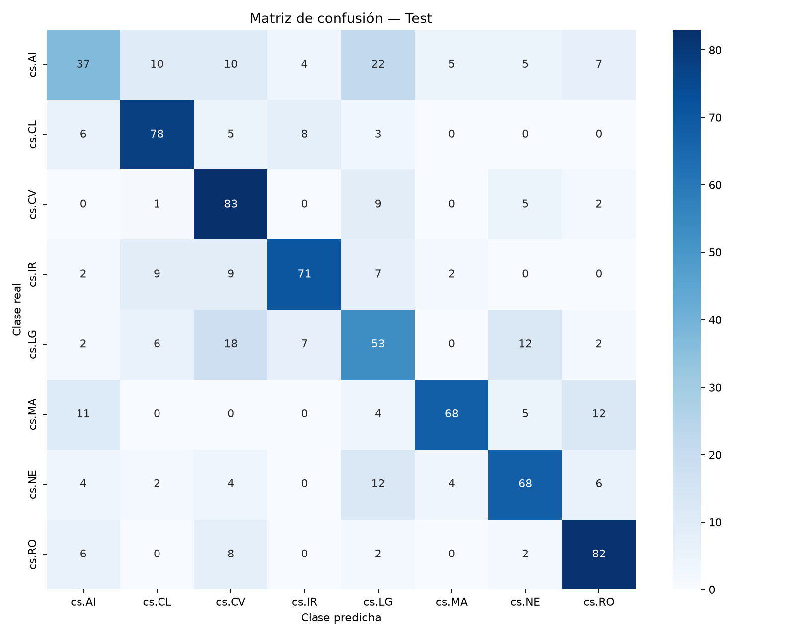
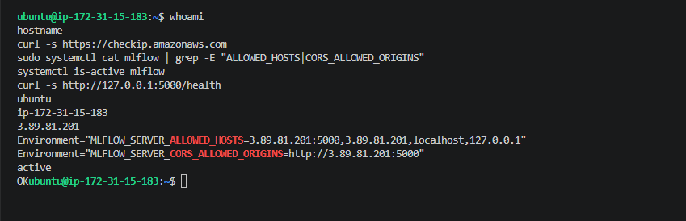
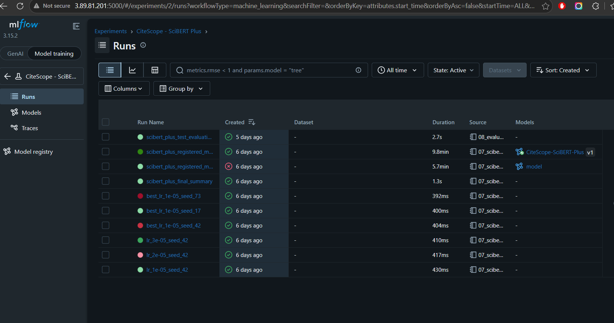
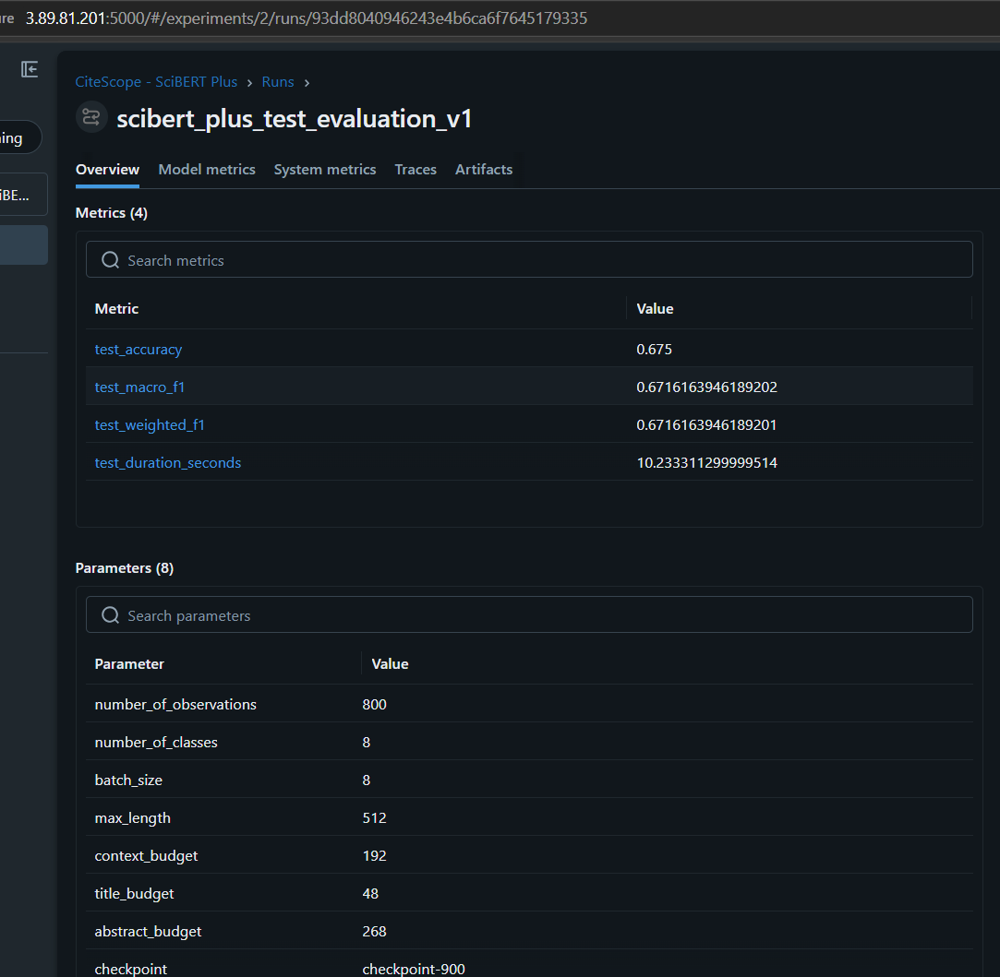
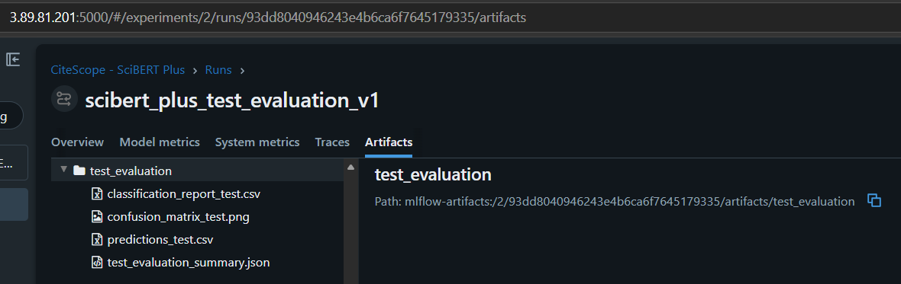

CiteScope

<h1>Clasificación de subáreas de Computer Science a partir de contextos de cita</h1>

<h2>Entrega 2 — Microproyecto</h2>

<strong>Proyecto — Desarrollo de Soluciones / MAIA</strong> 
<strong>Grupo 8</strong>

<strong>Camilo Bejarano</strong> 
<strong>German Rodriguez</strong> 
<strong>Jose Arteaga</strong> 
<strong>Sebastian Toro</strong>

Universidad de los Andes 
Septiembre de 2026

# 1. Resumen del problema

## 1.1 Contexto y pregunta de negocio

El crecimiento acelerado de la literatura científica en arXiv dificulta la organización, indexación y recuperación de artículos por subárea temática. En Computer Science, el contexto en el que un artículo cita a otro y los metadatos del trabajo citado aportan señales semánticas que pueden utilizarse para clasificar automáticamente el área del artículo citante.

CiteScope busca responder la siguiente pregunta de negocio:

> ¿Es posible predecir la subárea de Computer Science de un artículo científico a partir del contexto de una cita y del título y el resumen del artículo citado?

## 1.2 Objetivo y alcance

El objetivo es desarrollar un prototipo funcional que clasifique un contexto de cita en una de ocho subáreas `cs.*` de arXiv. La entrada combina el contexto de la cita, el título y el resumen del artículo citado; la salida corresponde a la categoría predicha, su nivel de confianza y la distribución de probabilidades entre las ocho clases.

La Entrega 2 comprende el desarrollo y comparación de modelos supervisados, el seguimiento de experimentos con MLflow, la evaluación del modelo seleccionado y el avance de un tablero que permita consumir y visualizar las predicciones. El producto tiene un propósito académico y exploratorio; no pretende sustituir procesos formales de indexación bibliográfica.

## 1.3 Datos utilizados

Se utiliza un conjunto construido a partir de **unarXive** y enriquecido con metadatos de **OpenAlex**. El dataset contiene 4.000 registros balanceados, con 500 ejemplos para cada una de las siguientes subáreas: `cs.AI`, `cs.CL`, `cs.CV`, `cs.IR`, `cs.LG`, `cs.MA`, `cs.NE` y `cs.RO`.

| Campo | Función |
|---|---|
| `citation_context` | Párrafo del artículo citante donde aparece la cita. |
| `cited_title` | Título del artículo citado. |
| `cited_abstract` | Resumen del artículo citado. |
| `citing_primary_category` | Subárea `cs.*` utilizada como variable objetivo. |

El 100% de los registros contiene contexto de cita; el 97,9% tiene un título citado no vacío y el 98,1% contiene el resumen del artículo citado. El archivo local tiene el mismo hash MD5 registrado en DVC (`ab4dae83062d1de3238c419cbd3d3a4c`), lo que confirma la correspondencia con la versión de datos utilizada en los experimentos.

## 1.4 Cambios respecto a la Entrega 1

La Entrega 1 delimitó el problema, seleccionó la fuente de datos, construyó el dataset y definió la maqueta inicial. Desde entonces se implementó una partición reproducible sin cruce de artículos citantes, se entrenaron modelos clásicos y basados en SciBERT, se registraron experimentos en MLflow y se realizó una evaluación final sobre el conjunto de test reservado. También se desarrolló un prototipo navegable del tablero, cuya integración con la API y el modelo se encuentra en progreso.

<!-- PASO 2: completar y revisar la sección de modelos con resultados reales. -->

# 2. Modelos desarrollados y evaluación

## 2.1 Preparación de datos y protocolo de evaluación

Los 4.000 registros se dividieron de forma reproducible en entrenamiento (2.400; 60%), validación (800; 20%) y test (800; 20%), utilizando la semilla 42. La asignación se realizó por `citing_arxiv_id`, de modo que todos los contextos provenientes de un mismo artículo citante permanecieran en una sola partición. No se encontraron artículos citantes compartidos entre los tres subconjuntos y cada partición conservó exactamente la misma proporción de las ocho clases.

El conjunto de validación se utilizó para comparar modelos, seleccionar hiperparámetros y escoger el checkpoint. El test permaneció reservado hasta finalizar esas decisiones y se evaluó una sola vez con el modelo registrado. Como limitación, el 33,4% de los registros de test contiene al menos una obra citada que también aparece en train; aunque el artículo citante y la variable objetivo permanecen aislados, esta coincidencia constituye una posible dependencia semántica residual que debe considerarse al interpretar la generalización.

Para los modelos clásicos se construyeron dos entradas: `text_context`, que utiliza únicamente el contexto de la cita, y `text_enriched`, que concatena contexto, título y resumen. La representación empleó TF-IDF con unigramas y bigramas, `min_df=3` y escalamiento sublineal. Para SciBERT Plus se conservaron segmentos separados dentro de una longitud máxima de 512 tokens: 192 para el contexto, 48 para el título y 268 para el resumen, además de los tokens especiales.

## 2.2 Modelos comparados

| Modelo | Entrada y configuración principal | Propósito |
|---|---|---|
| Logistic Regression | TF-IDF; contexto solamente | Línea base interpretable y de bajo costo. |
| Linear SVC | TF-IDF; contexto solamente | Segunda referencia clásica. |
| Logistic Regression enriquecido | TF-IDF; contexto, título y resumen | Medir el aporte de los metadatos citados. |
| Linear SVC enriquecido | TF-IDF; contexto, título y resumen | Contrastar el efecto del enriquecimiento. |
| Logistic Regression ajustado | Búsqueda de hiperparámetros sobre texto enriquecido | Verificar si el ajuste supera la configuración predeterminada. |
| SciBERT | `allenai/scibert_scivocab_uncased`, máximo 512 tokens | Aprovechar representaciones preentrenadas sobre texto científico. |
| SciBERT Plus | Presupuesto de tokens por campo, búsqueda de *learning rate* y tres semillas | Mejorar el uso de la entrada y medir estabilidad. |
| Ensamble | 90% SciBERT Plus y 10% Logistic Regression | Combinar señales neuronales y léxicas. |

## 2.3 Resultados de validación y test

| Modelo | Macro F1 val | Accuracy val |
|---|---:|---:|
| Logistic Regression — contexto | 0,5696 | 0,5713 |
| Linear SVC — contexto | 0,5523 | 0,5588 |
| Logistic Regression — enriquecido | 0,6277 | 0,6288 |
| Linear SVC — enriquecido | 0,6090 | 0,6125 |
| Logistic Regression — ajustado | 0,6145 | 0,6150 |
| SciBERT | 0,6836 | 0,6800 |
| SciBERT Plus | 0,6958 | 0,6950 |
| Ensamble SciBERT Plus + Logistic Regression | **0,6981** | **0,6975** |

El enriquecimiento aumentó el Macro F1 de Logistic Regression en 0,0581 frente al contexto solo. SciBERT mejoró otros 0,0559 respecto al mejor modelo clásico enriquecido. En SciBERT Plus, un *learning rate* de `1e-05` produjo el mejor resultado; al repetir esta configuración con semillas 42, 17 y 73 se obtuvo un Macro F1 medio de 0,6870 y una desviación estándar de 0,0077.

El ensamble obtuvo el mayor resultado de validación, pero su ganancia sobre SciBERT Plus fue de solo 0,0022. El artefacto finalmente registrado y evaluado en test fue el checkpoint individual de SciBERT Plus con semilla 42, no el ensamble. Sobre las 800 observaciones reservadas obtuvo **0,6750 de accuracy**, **0,6716 de Macro F1** y **0,6716 de Weighted F1**. La disminución frente a validación fue de aproximadamente 0,0242 puntos de Macro F1.

<!-- EVIDENCIA PENDIENTE: gráfica compacta de comparación de modelos en validación y test. -->

## 2.4 Evaluación por clase y análisis de errores

| Clase | Precision | Recall | F1 | Soporte |
|---|---:|---:|---:|---:|
| `cs.AI` | 0,5441 | 0,3700 | 0,4405 | 100 |
| `cs.CL` | 0,7358 | 0,7800 | 0,7573 | 100 |
| `cs.CV` | 0,6058 | 0,8300 | 0,7004 | 100 |
| `cs.IR` | 0,7889 | 0,7100 | 0,7474 | 100 |
| `cs.LG` | 0,4732 | 0,5300 | 0,5000 | 100 |
| `cs.MA` | 0,8608 | 0,6800 | 0,7598 | 100 |
| `cs.NE` | 0,7010 | 0,6800 | 0,6904 | 100 |
| `cs.RO` | 0,7387 | 0,8200 | **0,7773** | 100 |

El desempeño más alto corresponde a `cs.RO`, seguido de `cs.MA` y `cs.CL`. La principal dificultad está en `cs.AI`, cuyo recall de 0,37 se explica principalmente por 22 ejemplos clasificados como `cs.LG`, además de diez asignados a `cs.CL` y diez a `cs.CV`. En `cs.LG`, 18 ejemplos se confundieron con `cs.CV` y 12 con `cs.NE`. También se observan 12 casos de `cs.MA` asignados a `cs.RO`. Estos patrones evidencian solapamiento entre áreas relacionadas; en contraste, el vocabulario más especializado de Robotics facilita su diferenciación.

<figure>
  
  <figcaption><strong>Figura 5.</strong> Matriz de confusión de SciBERT Plus sobre 800 observaciones de test. Cada clase contiene 100 ejemplos.</figcaption>
</figure>

<!-- PASO 3: incorporar capturas verificables de MLflow y EC2. -->

# 3. Experimentos y trazabilidad con MLflow

## 3.1 Configuración y corridas registradas

Los experimentos se gestionaron con **MLflow 3.15.2** mediante un servidor de seguimiento desplegado en una instancia AWS EC2. Los artefactos del modelo se almacenaron de manera remota y el código obtuvo la URI del servidor a través de la variable de entorno `MLFLOW_TRACKING_URI`. Esta configuración permitió entrenar localmente con GPU, centralizar resultados y recuperar posteriormente el modelo registrado.

El experimento principal se denominó `CiteScope - SciBERT Plus` y quedó asociado al identificador 2. Las corridas registraron, según su propósito, el nombre del modelo, estrategia de entrada, semilla, *learning rate*, número de épocas, longitud máxima, presupuesto de tokens por campo, duración de entrenamiento, Macro F1 y accuracy de validación. También se almacenaron archivos CSV de resultados, configuración, tokenizer, pesos y checkpoints.

| Grupo de corridas | Configuraciones | Resultado principal |
|---|---|---|
| Búsqueda de *learning rate* | `1e-05`, `2e-05` y `3e-05`; semilla 42 | `1e-05` obtuvo Macro F1 val de 0,6958. |
| Estabilidad entre semillas | Semillas 42, 17 y 73 con LR `1e-05` | Media 0,6870; desviación estándar 0,0077. |
| Resumen SciBERT Plus | Mejor checkpoint y artefactos de las comparaciones | SciBERT Plus 0,6958; ensamble 0,6981 en validación. |
| Evaluación final | Modelo versión 1; 800 registros de test | Macro F1 0,6716; accuracy 0,6750. |

El checkpoint de SciBERT Plus con LR `1e-05` y semilla 42 se registró como `CiteScope-SciBERT-Plus`, versión 1. Inicialmente recibió el alias `candidate`; después de la evaluación única sobre test se marcó con `test_evaluated=true` y se promovió al alias `champion`. La URI estable para su consumo por otros componentes es `models:/CiteScope-SciBERT-Plus@champion`.

Antes de la evaluación final se comprobó que el modelo registrado podía descargarse y ejecutar una inferencia de prueba. El run de evaluación guardó el reporte de clasificación, las predicciones con probabilidades, la matriz de confusión de test, el resumen JSON y las métricas finales. Así, la selección basada en validación, la evaluación de test y la versión disponible para inferencia quedan separadas y trazables.

## 3.2 Evidencias de MLflow en AWS EC2

Las evidencias visuales deben mostrar la correspondencia entre la infraestructura, las corridas y el modelo registrado. Se incluirán capturas de la terminal conectada a EC2 con usuario e IP visibles; la vista general del experimento con sus corridas; el detalle de parámetros, métricas y artefactos de SciBERT Plus; y la evaluación final de test asociada a la versión 1.

<figure>
  
  <figcaption><strong>Figura 1.</strong> Conexión a AWS EC2 y verificación del servidor MLflow: usuario, host, IP pública, restricciones de acceso, servicio activo y respuesta del endpoint de salud.</figcaption>
</figure>

<figure>
  
  <figcaption><strong>Figura 2.</strong> Vista general de las corridas registradas en MLflow, incluyendo búsqueda de <em>learning rate</em>, estabilidad entre semillas, resumen del modelo, registro del artefacto y evaluación final.</figcaption>
</figure>

<figure>
  
  <figcaption><strong>Figura 3.</strong> Evaluación final de SciBERT Plus sobre 800 observaciones de test: accuracy de 0,6750, Macro F1 de 0,6716 y configuración estructurada de 512 tokens.</figcaption>
</figure>

<figure>
  
  <figcaption><strong>Figura 4.</strong> Artefactos de test almacenados en MLflow: reporte por clase, matriz de confusión, predicciones con probabilidades y resumen reproducible de la evaluación.</figcaption>
</figure>

<!-- PASO 4: redactar conclusiones a partir de las métricas finales. -->

# 4. Observaciones y conclusiones sobre los modelos

Los experimentos muestran que los metadatos del artículo citado sí aportan información útil. Al añadir título y resumen, Logistic Regression pasó de 0,5696 a 0,6277 de Macro F1, una mejora absoluta de 0,0581. El beneficio se observó en siete de las ocho clases del modelo clásico; `cs.CL` fue la única con una variación ligeramente negativa. Esto indica que el contexto local de la cita no contiene por sí solo toda la información necesaria para distinguir la subárea del artículo citante.

El ajuste automático de Logistic Regression no superó la configuración enriquecida original: obtuvo 0,6145 frente a 0,6277. Por tanto, aumentar la complejidad de la búsqueda no garantizó una mejora. En cambio, SciBERT alcanzó 0,6836, lo que respalda el uso de representaciones preentrenadas sobre literatura científica. La asignación estructurada de tokens y la reducción del *learning rate* elevaron el resultado individual hasta 0,6958.

El ensamble alcanzó 0,6981 en validación, pero mejoró únicamente 0,0022 respecto a SciBERT Plus y requiere mantener un segundo pipeline de vectorización e inferencia. Por esta razón se registró como artefacto desplegable el checkpoint individual de **SciBERT Plus**, versión 1. Su resultado final de test —Macro F1 de 0,6716 y accuracy de 0,6750— es inferior al de validación, pero conserva una mejora clara frente a los modelos clásicos y ofrece una estimación más realista de generalización.

El análisis por clase revela que el desempeño no es uniforme. `cs.RO`, `cs.MA` y `cs.CL` presentan los F1 más altos, mientras que `cs.AI` y `cs.LG` concentran las mayores dificultades. La matriz de confusión sugiere que parte del error proviene del solapamiento temático entre Artificial Intelligence, Machine Learning, Computer Vision y Neural Computing, no solamente de fallas de optimización.

En conclusión, **SciBERT Plus versión 1** se selecciona como modelo del prototipo por ser la alternativa individual con mejor validación, contar con una evaluación de test aislada y disponer de un artefacto reproducible en MLflow bajo el alias `champion`. Antes de considerar un uso más amplio se requiere estudiar calibración de probabilidades, ampliar y actualizar los datos, revisar la taxonomía de categorías cercanas, cuantificar el costo de inferencia y evaluar el efecto del solapamiento residual de obras citadas entre particiones.

<!-- PASO 5: actualizar después de integrar frontend y API. -->

# 5. Tablero desarrollado

## 5.1 Funcionalidades y relación con la pregunta de negocio

## 5.2 Integración con el modelo

## 5.3 Evidencias del tablero

<!-- PASO 6: consolidar enlaces, commits y evidencia individual. -->

# 6. Repositorio, fuentes y soportes

# 7. Reporte de trabajo en equipo

# 8. Conclusiones finales

# Referencias
