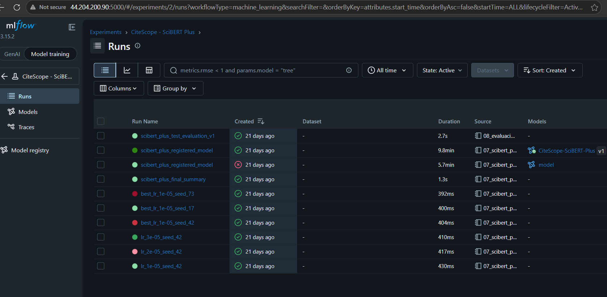
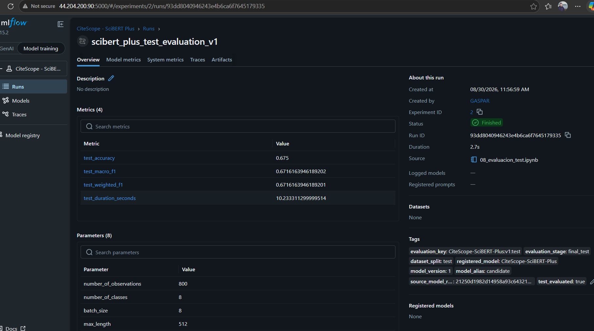
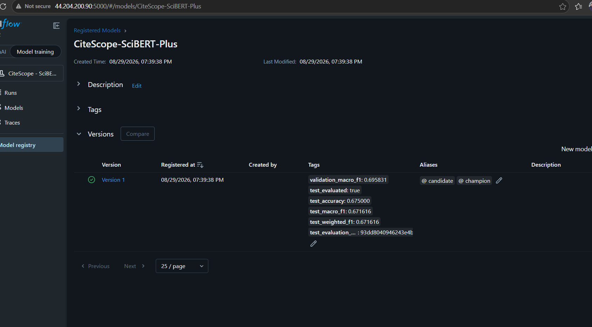
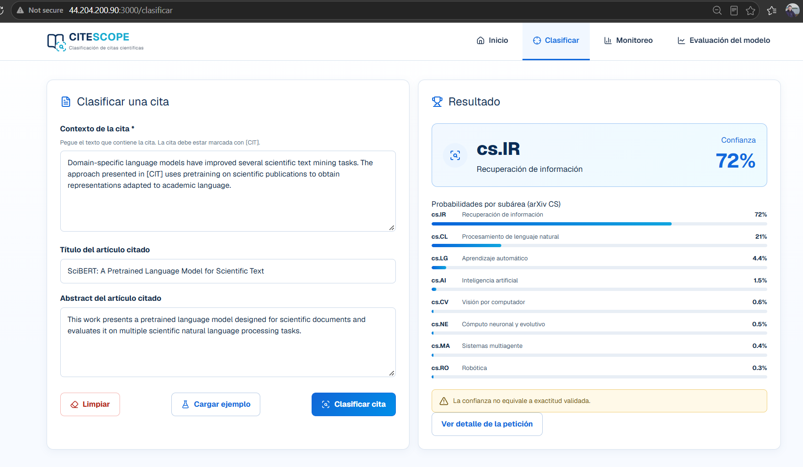
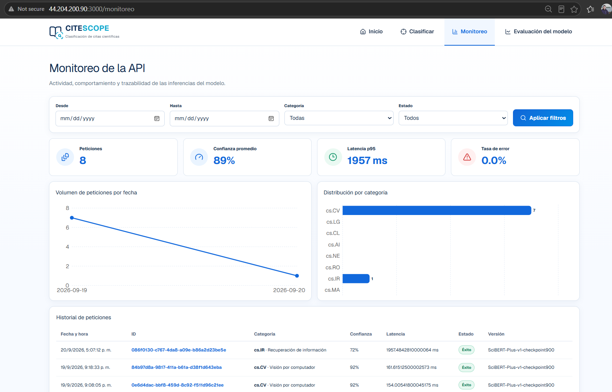
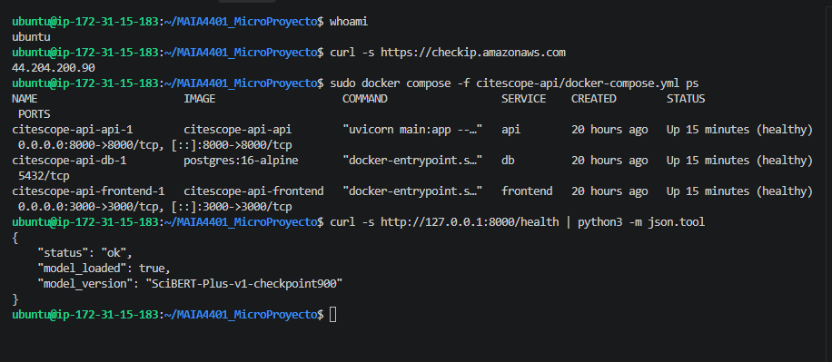
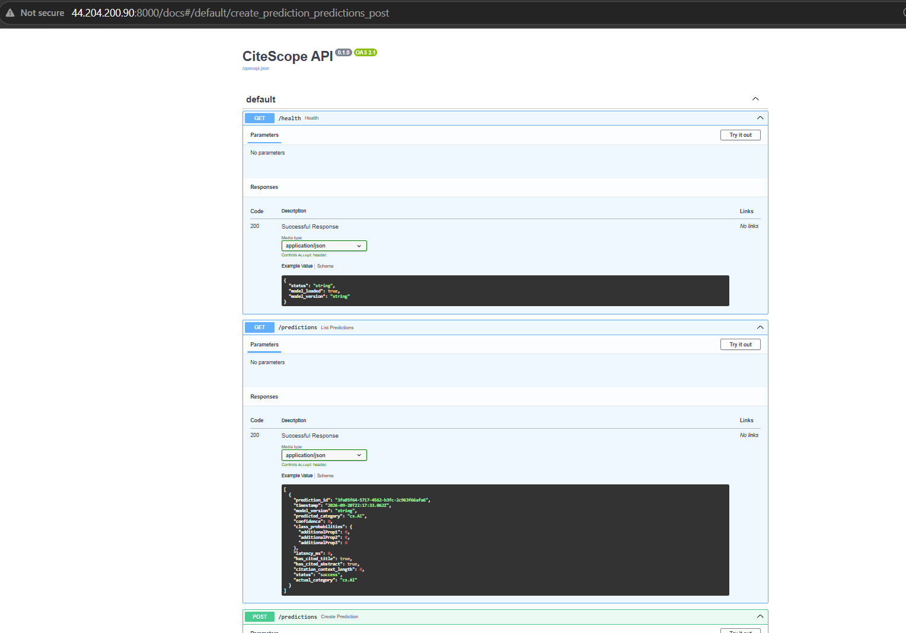
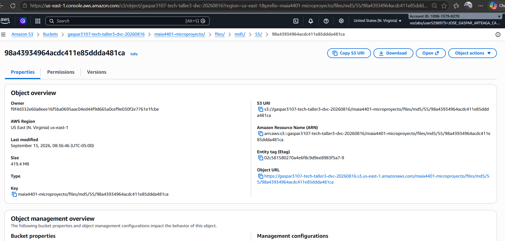

CiteScope

<h1>Microproyecto — Entrega 3</h1>

<h2>Clasificación de artículos científicos a partir del contexto de citación</h2>

<strong>Proyecto — Desarrollo de Soluciones / MAIA — Grupo 8</strong>

<strong>Camilo Bejarano&nbsp;&nbsp;·&nbsp;&nbsp;German Rodriguez&nbsp;&nbsp;·&nbsp;&nbsp;Jose Arteaga&nbsp;&nbsp;·&nbsp;&nbsp;Sebastian Toro</strong>

Universidad de los Andes — Septiembre de 2026

# 1. Resumen del problema

## 1.1 Contexto, pregunta de negocio y alcance

El crecimiento de la literatura científica en arXiv dificulta organizar, indexar y recuperar artículos por subárea. En Computer Science, el contexto en el que un trabajo cita a otro y los metadatos del artículo citado aportan señales semánticas que pueden utilizarse para clasificar automáticamente el área temática del artículo citante.

> **Pregunta de negocio:** ¿es posible predecir la subárea de Computer Science de un artículo científico a partir del contexto de una cita y del título y resumen del artículo citado?

CiteScope responde esta pregunta mediante un prototipo funcional que recibe un contexto marcado con `[CIT]`, el título y el resumen del artículo citado; produce una de ocho categorías `cs.*`, la confianza de la clase ganadora y la distribución completa de probabilidades. El producto tiene fines académicos y exploratorios: apoya la organización y análisis de literatura, pero no sustituye procesos formales de indexación bibliográfica.

## 1.2 Datos y punto de partida

Como base se conserva el conjunto documentado en la Entrega 2, construido a partir de **unarXive** y enriquecido con metadatos de **OpenAlex**. Contiene 4.000 registros balanceados, 500 por categoría: `cs.AI`, `cs.CL`, `cs.CV`, `cs.IR`, `cs.LG`, `cs.MA`, `cs.NE` y `cs.RO`. Cada registro incluye `citation_context`, `cited_title`, `cited_abstract` y `citing_primary_category`; el dataset se versionó con DVC.

La división por `citing_arxiv_id` fue entrenamiento (2.400; 60%), validación (800; 20%) y test (800; 20%), evitando que contextos de un mismo artículo citante aparecieran en particiones diferentes. El test se utilizó una sola vez después de seleccionar el modelo. El detalle del análisis exploratorio, preparación y baselines se encuentra en la Entrega 2; aquí se presenta únicamente su resultado consolidado y la evolución hacia el producto desplegado.

## 1.3 Cambios respecto a la Entrega 2

La Entrega 2 dejó seleccionado y evaluado SciBERT Plus, un frontend navegable y una primera API. Para la entrega final se completaron los elementos que convierten ese avance en un producto integrado:

- el frontend reemplazó las respuestas simuladas de clasificación y monitoreo por llamadas reales a FastAPI;
- la API carga el modelo entrenado, realiza inferencias y persiste su resultado en PostgreSQL;
- `model.safetensors` se versionó con DVC y se almacenó en S3 para desacoplar la inferencia de la disponibilidad temporal de MLflow;
- PostgreSQL, FastAPI y Next.js se empaquetaron mediante Docker Compose, junto con una inicialización idempotente que obtiene el modelo si aún no existe localmente;
- el sistema completo se desplegó en una instancia AWS EC2 y se validaron los estados de salud, la carga del modelo y la respuesta del frontend;
- se elaboró el manual de usuario y se prepararon los espacios para enlazar el manual de instalación, el video final y la evidencia de retroalimentación.

# 2. Modelo seleccionado y evaluación final

## 2.1 Resultado consolidado de la selección

La Entrega 2 comparó modelos clásicos con TF-IDF y modelos basados en `allenai/scibert_scivocab_uncased`. El principal hallazgo fue que enriquecer el contexto con título y resumen mejora la clasificación, y que un modelo preentrenado sobre literatura científica representa mejor el lenguaje del dominio.

**SciBERT Plus** conserva los tres campos como segmentos estructurados dentro de un máximo de 512 tokens: 192 para contexto, 48 para título, 268 para abstract y cuatro tokens especiales. Tras evaluar distintas tasas de aprendizaje y semillas, se seleccionó el checkpoint individual con *learning rate* `1e-05`, semilla 42 y checkpoint 900.

| Hito de comparación                   | Macro F1 validación | Accuracy validación |
| -------------------------------------- | -------------------: | -------------------: |
| Regresión logística — contexto         |               0,5696 |               0,5713 |
| Regresión logística — entrada enriquecida |               0,6277 |               0,6288 |
| SciBERT                                |               0,6836 |               0,6800 |
| **SciBERT Plus seleccionado**          |         **0,6958** |         **0,6950** |
| Ensamble 90% SciBERT Plus + 10% LR     |               0,6981 |               0,6975 |

El ensamble obtuvo la mayor validación, pero mejoró solo 0,0022 frente a SciBERT Plus y exige mantener dos pipelines de inferencia. Por parsimonia, reproducibilidad y costo operativo se seleccionó el checkpoint individual. La comparación completa de algoritmos, hiperparámetros y semillas permanece documentada en la Entrega 2.

## 2.2 Evaluación final

La versión seleccionada se evaluó una única vez sobre 800 registros de test: obtuvo **0,6750 de accuracy**, **0,6716 de Macro F1** y **0,6716 de Weighted F1**. `cs.RO` presentó el mayor F1 (0,7773), seguido de `cs.MA` (0,7598) y `cs.CL` (0,7573). Las clases más difíciles fueron `cs.AI` (0,4405) y `cs.LG` (0,5000), principalmente por el solapamiento temático entre Inteligencia Artificial, Machine Learning, Computer Vision y Neural Computing.

<figure>
  
  <figcaption><strong>Figura 1.</strong> Matriz de confusión de SciBERT Plus sobre 800 observaciones de test, 100 por clase.</figcaption>
</figure>

## 2.3 Trazabilidad con MLflow

Los experimentos se centralizaron en **MLflow 3.15.2**, desplegado como servicio en AWS EC2. El experimento `CiteScope - SciBERT Plus` registró parámetros, semillas, presupuestos de tokens, métricas, duración, checkpoints, tokenizer y resultados. El modelo quedó registrado como `CiteScope-SciBERT-Plus`, versión 1; después de la evaluación de test se promovió del alias `candidate` a `champion`.

<figure>
  
  <figcaption><strong>Figura 2.</strong> Corridas de búsqueda de learning rate, estabilidad, registro y evaluación final en MLflow desplegado en AWS; la barra del navegador evidencia la IP pública y el puerto 5000.</figcaption>
</figure>

<figure>
  
  <figcaption><strong>Figura 3.</strong> Métricas y parámetros de la evaluación final del modelo registrado.</figcaption>
</figure>

<figure>
  
  <figcaption><strong>Figura 4.</strong> Modelo `CiteScope-SciBERT-Plus`, versión 1, con métricas finales y alias `champion`; la URL evidencia su ejecución en la instancia AWS EC2.</figcaption>
</figure>

# 3. Producto desarrollado

## 3.1 Arquitectura y flujo de inferencia

La solución separa responsabilidades en componentes reproducibles:

| Componente   | Tecnología                       | Responsabilidad                                                                                   |
| ------------ | --------------------------------- | ------------------------------------------------------------------------------------------------- |
| Tablero      | Next.js 16, React 19 y TypeScript | Interfaz de interacción con el usuario, recibe las entradas y presentar predicción, historial, monitoreo y evaluación.                     |
| API          | FastAPI, PyTorch y Transformers   | Validar el contrato, preparar los segmentos, ejecutar SciBERT Plus y devolver probabilidades.     |
| Persistencia | PostgreSQL 16                     | Guardar los logs de ejecución de los modelos, con datos como identificador, fecha, versión, categoría, confianza, probabilidades, latencia y estado. |
| Modelo       | SciBERT Plus v1                   | Clasificar la cita entre ocho subáreas.                                                          |
| Artefactos   | DVC y Amazon S3                   | Mantener la copia canónica y trazable de `model.safetensors` sin almacenarla directamente en Git. |
| Inicialización | `model-init` y `gdown`          | Comprobar si el checkpoint existe y, en una instalación limpia, descargar automáticamente un espejo operativo. |
| Experimentos | MLflow en EC2                     | Mantener métricas, parámetros, artefactos y registro del modelo.                                |
| Despliegue   | Docker Compose en AWS EC2         | Ejecutar base de datos, API y frontend en contenedores aislados.                                  |

El navegador consulta rutas `/api` del frontend; el servidor Next.js reenvía las solicitudes al servicio FastAPI dentro de la red de Docker. La API carga al iniciar el directorio `/app/model_artifacts`, montado en modo de solo lectura, y mantiene el modelo en memoria. Una inferencia exitosa se registra en PostgreSQL antes de devolver la respuesta al usuario. MLflow no participa en cada predicción: conserva la trazabilidad experimental; DVC/S3 mantiene el artefacto canónico, y el despliegue dispone además de un espejo para automatizar el arranque en equipos sin el checkpoint local.

## 3.2 API y persistencia

| Método y ruta        | Función                                                                                                             |
| --------------------- | -------------------------------------------------------------------------------------------------------------------- |
| `GET /health`       | Confirma que la API está activa, el modelo está cargado y reporta su versión.                                     |
| `POST /predictions` | Recibe contexto, título y abstract; ejecuta inferencia, persiste y devuelve categoría, confianza y probabilidades. |
| `GET /predictions`  | Recupera el historial de inferencias almacenadas en PostgreSQL.                                                      |

El contrato utiliza ocho códigos arXiv y conserva valores nulos cuando una predicción falla. Cada respuesta exitosa incluye un UUID, sello de tiempo, versión `SciBERT-Plus-v1-checkpoint900`, distribución por clase y latencia. La base de datos no se publica en internet; solo es accesible por los servicios internos de Compose.

## 3.3 Tablero

| Vista                                   | Funcionalidad final                                                                                                            |
| --------------------------------------- | ------------------------------------------------------------------------------------------------------------------------------ |
| Inicio (`/`)                          | Página de bienvenida al proyecto CiteScope, ceunta con los links  a las opciones de clasificación, monitoreo y evaluación.                                                         |
| Clasificar (`/clasificar`)            | Página que permite realizar las inferencias, el usaurio ingresa el contexto que es una campo obligatorio, el título y abstract son opcionales; llama a la API y presenta el resultado de la inferencia en las 9 categorías, confianza y probabilidades.  |
| Monitoreo (`/monitoreo`)              | Página que permite visualizar el contexto global de uso del modelo, al presentar las peticiones, confianza promedio, latencia y tasa de error; Adiconalmente permite visualizar el listado de ejecuciones, filtrar e ir al detalle de cada ejecuión                            |
| Detalle (`/monitoreo/[predictionId]`) | Página que presenta la trazabilidad, entrada disponible, versión, latencia y probabilidades de una inferencia.                              |
| Evaluación (`/evaluacion`)           | Página pagina que muestra resultados estáticos y verificables del test: métricas globales, F1 por clase, matriz y comparación de validación. |

La integración final elimina respuestas ficticias en clasificación y monitoreo ya que ya se cuenta con integración con el API.

*Para poder observar todos las interfaces desarrolladas, vaya a la seccion de #Mockups*

<figure>
  
  <figcaption><strong>Figura 5.</strong> Se muestra una inferencia desde la URL pública: los tres campos de entrada producen la categoría `cs.IR`, 72% de confianza y la distribución completa de probabilidades.</figcaption>
</figure>

<figure>
  
  <figcaption><strong>Figura 6.</strong> Se observa el monitoreo operativo con ocho peticiones persistidas, indicadores de confianza, latencia y error, distribución por categoría e historial asociado a la versión desplegada.</figcaption>
</figure>

# 4. Empaquetamiento y despliegue en la nube

El archivo `citescope-api/docker-compose.yml` define `db`, `model-init`, `api` y `frontend`. PostgreSQL utiliza un volumen persistente; `model-init` comprueba si el checkpoint ya existe y, si falta, descarga un espejo mediante `gdown`; FastAPI espera a que la base de datos esté saludable y a que la inicialización termine; y Next.js espera a que `/health` confirme `model_loaded=true`. Los pesos no se copian a la imagen y se montan en modo de solo lectura en la API, por lo que pueden actualizarse sin reconstruirla.

El modelo de 439.722.000 bytes se controla mediante `citescope-api/model_artifacts/model.safetensors.dvc`, cuyo hash MD5 es `5598a43934964acdc411e85ddda481ca`. El objeto canónico reside en el remoto DVC `s3://gaspar3107-tech-taller3-dvc-20260816/maia4401-microproyecto`; el espejo usado por `model-init` facilita la instalación sin sustituir dicho control de versión. Esta separación evita que la API dependa de las cuatro horas de disponibilidad de la sesión de AWS Academy destinada a MLflow.

El despliegue final se ejecutó sobre una instancia EC2 Ubuntu 24.04 con Docker Engine y Compose. Se verificó que los tres contenedores quedaran saludables, que `/health` respondiera `model_loaded: true` y que el frontend devolviera HTTP 200. Los puertos 22, 3000, 5000 y 8000 se restringieron mediante el grupo de seguridad; PostgreSQL permanece sin exposición pública.

| Servicio   |       Puerto | Verificación                               |
| ---------- | -----------: | ------------------------------------------- |
| Frontend   |         3000 | Página pública y flujo de clasificación. |
| FastAPI    |         8000 | Swagger y endpoint `/health`.              |
| MLflow     |         5000 | Interfaz de experimentos y registro.        |
| PostgreSQL | 5432 interno | Estado saludable dentro de Compose.         |

<figure>
  
  <figcaption><strong>Figura 7.</strong> Evidencia del despliegue en EC2: usuario, IP pública, tres servicios saludables y carga correcta de SciBERT Plus reportada por `/health`.</figcaption>
</figure>

<figure>
  
  <figcaption><strong>Figura 8.</strong> Contrato público de CiteScope API en FastAPI, con los endpoints de salud, creación y consulta de predicciones.</figcaption>
</figure>

<figure>
  
  <figcaption><strong>Figura 9.</strong> Objeto de 419,4 MB almacenado en S3 bajo la ruta derivada del hash registrado en `model.safetensors.dvc`.</figcaption>
</figure>

# 5. Resultados y conclusiones

CiteScope responde afirmativamente la pregunta de negocio a nivel de prototipo: el contexto de la cita, el título y el abstract permiten predecir la subárea del artículo citante con un Macro F1 de 0,6716 en test, claramente superior al azar de un problema balanceado de ocho clases. El aumento de 0,0581 de Macro F1 de Logistic Regression al incorporar metadatos respalda el diseño de entrada enriquecida; SciBERT Plus mejora además la representación del lenguaje científico.

La selección no se basó únicamente en el máximo decimal de validación. El ensamble superó a SciBERT Plus por 0,0022, pero duplicaba componentes de inferencia. La versión individual ofreció un mejor equilibrio entre desempeño, mantenibilidad y costo, y quedó trazable como `champion` en MLflow y como artefacto inmutable en DVC/S3.

La entrega también demuestra que el modelo aislado no constituye un producto. La combinación de API, persistencia, tablero y contenedores permite ejecutar inferencias reales y observar el servicio. Separar MLflow del camino operativo fue necesario por la disponibilidad limitada de AWS Academy: la API funciona con una copia local del checkpoint, recuperable desde DVC/S3 o mediante el espejo de inicialización, aun cuando el servidor de seguimiento se detenga.

Las principales limitaciones son el desempeño desigual entre categorías cercanas, la posible dependencia semántica por obras citadas repetidas, la ausencia de calibración formal de probabilidades y las restricciones del despliegue académico: IP pública dinámica, ausencia de HTTPS y autenticación, y recursos limitados de la instancia. Como trabajo futuro se propone calibrar la confianza, introducir paginación y consulta individual en la API, automatizar promoción/despliegue, utilizar dominio y TLS, y evaluar datos más amplios y recientes.

# 6. Repositorio y soportes de entrega

El código se encuentra en [MAIA4401_MicroProyecto](https://github.com/germarodr/MAIA4401_MicroProyecto). `dev` se utilizó como rama de integración y el estado final debe fusionarse en `main` antes de entregar. Los aportes individuales se conservan en el historial de commits.

| Soporte                            | Ubicación o estado                                                                                             |
| ---------------------------------- | --------------------------------------------------------------------------------------------------------------- |
| Datos y DVC                        | `Dataset/*.dvc`, `.dvc/config`, `scripts/`                                                                |
| Modelos y evaluación              | `models/01_preparacion_datos.ipynb` a `models/08_evaluacion_test.ipynb`                                     |
| Pesos desplegados                  | `citescope-api/model_artifacts/model.safetensors.dvc`                                                         |
| API y Docker                       | `citescope-api/api/`, `citescope-api/docker-compose.yml`                                                    |
| Frontend                           | `frontend/`                                                                                                   |
| Manual de usuario                  | [Manual de usuario de CiteScope](https://github.com/germarodr/MAIA4401_MicroProyecto/blob/dev/Reportes/Entrega%20Final/Manual_Usuario_CiteScope.pdf) |
| Manual de instalación             | [Manual de instalación de CiteScope](https://github.com/germarodr/MAIA4401_MicroProyecto/blob/dev/Reportes/Entrega%20Final/Manual_Instalaci%C3%B3n_CiteScope.html) |
| Video Presentación del proyecto     | [Video de presentación y demostración de CiteScope](https://drive.google.com/file/d/1FKqN6_wKn3LPOlDYMRLuO5GuJjNlnPxz/view) |

# 7. Reporte de trabajo en equipo

| Integrante       | Contribución acumulada y final                                                                                                                                             | Evidencia principal                                                                                                                                      |
| ---------------- | --------------------------------------------------------------------------------------------------------------------------------------------------------------------------- | -------------------------------------------------------------------------------------------------------------------------------------------------------- |
| Camilo Bejarano  | Diseñó la base de datos y desarrolló la API de inferencia, sus contratos, persistencia y endpoints; incorporó la descarga automatizada del modelo y el manual de instalación. | `citescope-api/api/`, `db/`, `docker-compose.yml`, manual de instalación; commits `ca6e103`, `1dedec7`, `3b9fabd`, `8a5db06`, `74674b7`. |
| German Rodriguez | Construyó y revisó preparación de datos, baselines y experimentos; consolidó documentación, realizó revisión cruzada e integró el manual de usuario.                    | `models/`, `Reportes/`; commits `4a796d3`, `b005fa8`, `9703984`, `d3f818b`, `31e8314`.                                                        |
| Jose Arteaga     | Configuró AWS EC2, SSH, MLflow y S3; desarrolló SciBERT Plus, registró/evaluó el modelo, versionó sus pesos con DVC y desplegó el sistema completo con Docker en EC2. | `models/07_scibert_plus.ipynb`, `08_evaluacion_test.ipynb`, evidencias AWS; commits `74eb914`, `442777b`, `d93ea90`, `afb5ffa`, `e07bad2`. |
| Sebastian Toro   | Diseñe arqutectura global, mockups y desarrolle el frontend; conecte clasificación y monitoreo con la API e incorporó frontend, API y base de datos al despliegue Docker Compose. valide y ajuste los manuales, sinocronize el equipo      | `mockups/`, `frontend/`, `citescope-api/docker-compose.yml`; commits `452a9d8`, `b981a2e`, `9036059`, `d1b8510`.                           |

# Referencias

- Beltagy, I., Lo, K., & Cohan, A. (2019). *SciBERT: A Pretrained Language Model for Scientific Text*. EMNLP-IJCNLP.
- Saier, T., Krause, J., & Färber, M. (2023). *unarXive 2022: All arXiv Publications Pre-Processed for NLP, Including Structured Full-Text and Citation Network*. JCDL.
- OpenAlex. https://openalex.org/
- MLflow. https://mlflow.org/
- DVC — Data Version Control. https://dvc.org/
- Docker. https://docs.docker.com/

------------------------------------------------------------------------ 
Universidad de los Andes 2026
-----------------------------------------------------------------------
