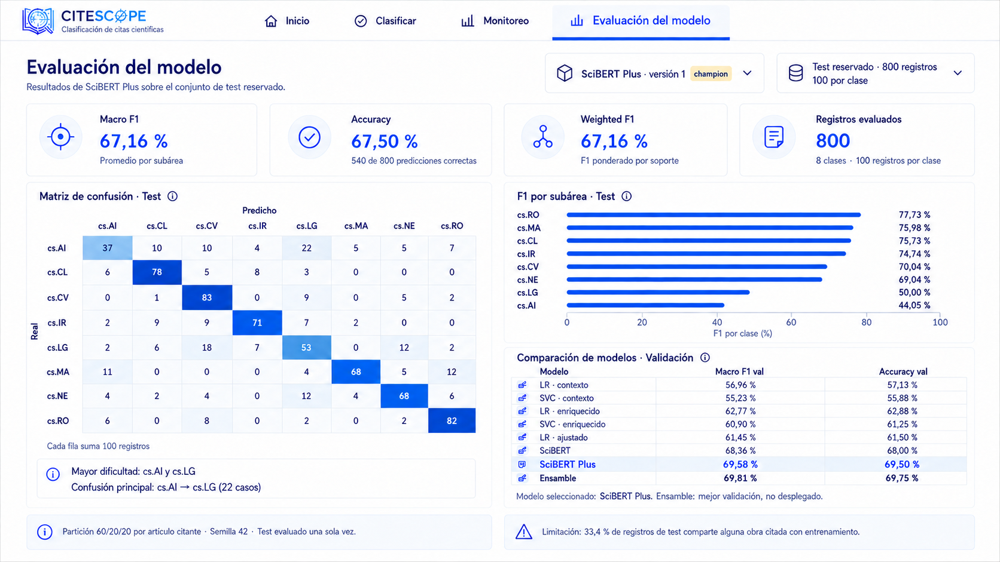

# Mockups de CiteScope

Propuesta visual para el prototipo de clasificación de subáreas de Computer
Science a partir de contextos de citas académicas.

## Pantallas

1. `01-inicio.png`: página de presentación, navegación y créditos del proyecto.
2. `02-clasificar.png`: formulario de entrada y probabilidades de clasificación.
3. `03-monitoreo.png`: métricas operativas, filtros e historial de peticiones.
4. `04-detalle-peticion.png`: detalle de una inferencia y validación del resultado.
5. **Vigente: `05-evaluacion-modelo_v2.png`**: evaluación de SciBERT Plus versión 1,
   alias `champion`, con los resultados de la Entrega 2. Las métricas de las
   tarjetas, barras y comparación de validación se expresan en porcentajes.
   La matriz conserva cantidades y el test contiene 800 registros.

`05-evaluacion-modelo.png` se conserva como versión inicial de la Entrega 1.

## Nota

La V2 de evaluación refleja los resultados documentados en la Entrega 2:
Macro F1 67,16 %, accuracy 67,50 % y Weighted F1 67,16 %. La comparación de
modelos corresponde a validación y está separada de las métricas de test.
Es una maqueta visual editada con el generador de imágenes integrado, no una
captura de la aplicación ejecutándose. El prompt de actualización está en
`05-evaluacion-modelo_v2.prompt.md`.

Las otras maquetas mantienen valores ilustrativos. En el frontend, la evaluación
carga los resultados desde un JSON local; la consulta a MLflow/API sigue pendiente.
